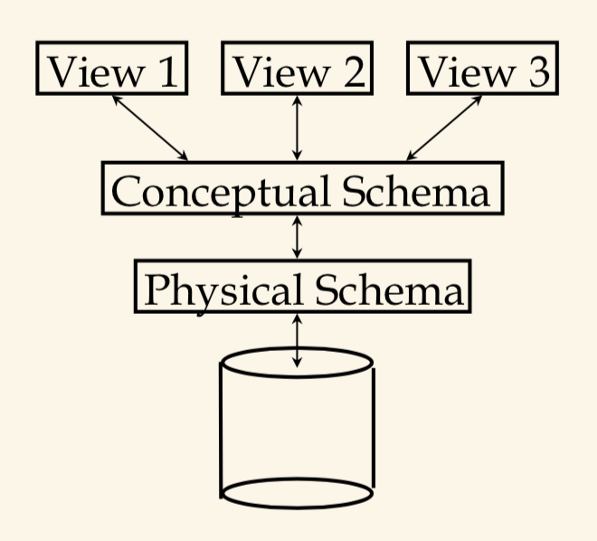
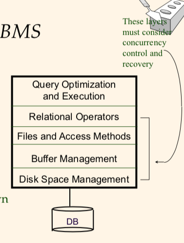
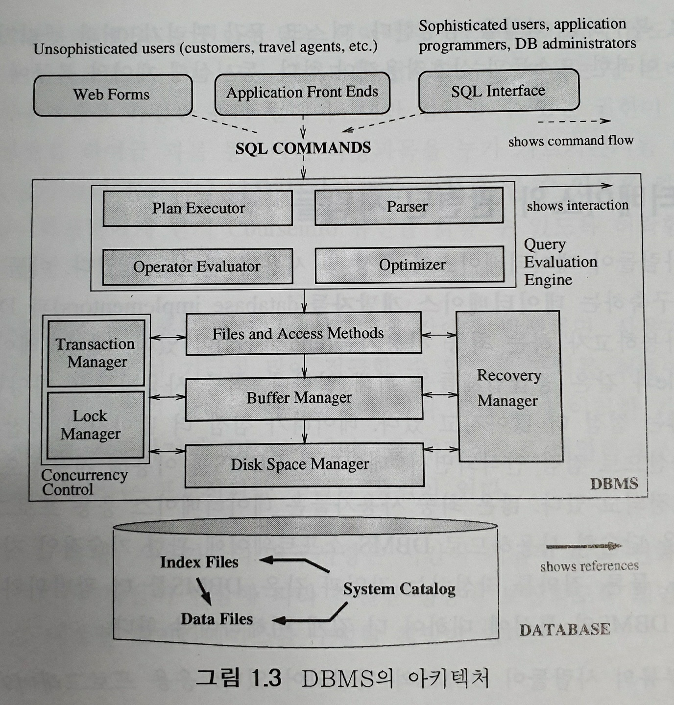

# DBMS 장점
* 데이터 독립성
    - 데이터의 표현과 저장에 세부사항 영향 x
    - 세부사항 은닉, 데이터의 추상화 제공

* 효율적인 데이터 접근
    - 효율적 저장 검색
* 데이터 무결성과 보안성
    - 데이터가 항상 DBMS를 통해서만 접근됨
    - 무결성 제약조건을 집행 가능
        + 직원의 급여를 삽입전 DBMS는 해당 부서의 예산이 초과되지 않나 점검가능
        + 여러 부류의 사용자에게 어떤 데이터가 보여질지 *접근제어* 가능
* 데이터 관리
    - 여러 사용자에게 데이터 공유시 데이터에 대한 관리를 중앙 집중화 
    - 그에 따른 상당한 개선
* 동시접근 및 손상복구 
    - 한 사용자에 의해 데이터가 접근된다고 생각 할 만큼 동시접근을 계획
    - 시스템 붕괴로 인한 영향 보호
* 응용 개발 시간 감축
    - 공통된 주용한 기능을 지원
    - DBMS가 알아서 잘 해줌

# DBMS 데이터 명세 및 저장
* 데이터 모델
    - 관계 데이터 모델
    - 의미적인 데이터 모델(semantic data model)
        + 추상적, 고수준 데이터 모델, 
        + 초기 명세 쉬움
* *관계모델 (Entity-relationship : ER)*
    - 릴레이션 (relation) 
    - 스키마 (schema)
        + 다음과 같은 스키마를 가진 릴레이션
            - Students(*sid*: string, *name*:string, *login*:string, *age*: integer, *gpa*:real)
    - 무결성 제약조건 (integrity constraint)
        + 한 릴레이션에 있는 레코드들이 반드시 만족해야하는 조건들
            - 각 학생의 *sid* 
            - 키값 정도 보면 될듯
* DBMS 추상화 
    - 링크 : https://raisonde.tistory.com/entry/%EC%8B%9C%ED%97%98%EB%8C%80%EB%B9%84-%EC%99%B8%EB%B6%80-%EC%8A%A4%ED%82%A4%EB%A7%88-%EA%B0%9C%EB%85%90-%EC%8A%A4%ED%82%A4%EB%A7%88-%EB%82%B4%EB%B6%80-%EC%8A%A4%ED%82%A4%EB%A7%88%EB%A5%BC-%EA%B5%AC%EB%B6%84%ED%95%98%EC%9E%90
    - </img>
    - 데이터 정의어(Data Definition Language: DDL)
        + 외부 스키마와 개념 스키마를 정의하기 위함
        + 개념 스키마, 외부 스키마, 물리적인 스키마는 모두 -> **시스템 카탈로그 (system catalog)** 에 저장됨
    - 개념 스키마
        + Students(...) Faculty(...) Courses(..) Enrolled(..) Teaches(..) 
        + 이런 릴레이션들을 정의하는 것
    - 물리적 스키마
        + 실제로 저장 장소에 어떻게 저장될지 
            - 모든 릴레이션들을 정렬되지 않은 레코드들로 구성된 파일로 저장
                + os 파일들은 문자열로 이루어진 파일
                + 반면 DBMS는 레코드들의 모딤, 페이지들의 모임 파일
    - 외부 스키마 (서브 스키마)
        - **쉽게 말해 view 라고 생각하면 됨, 어떤 조회된 결과값들이 나오는 테이블, 하지만 외부 스키마가 조회된 결과값을 의미하는건 아님**
        - 각 외부 스키마는 특정 사용자 그룹의 목적에 맞게 만들어짐
        - 그룹의 목적에 맞도록 개념 스키마로부터 만들어짐
        - 하나 이상의 뷰(view)와 릴레이션으로 이루어짐
        - 뷰는 개념적으로 하나의 릴레이션
        - 뷰 내에 있는 레코드들은 DBMS에 저장 되지 *않는다*
* 데이터 독립성 (data independence)
    - 데이터의 구성과 저장 방식의 변화로부터 격리
    - 3단계 데이터 추상화를 통해 
    - 개념 스키마와 외부 스키마의 분리가 독립성 유지 ㅆㅅㅌㅊ
    - 이유 : 파일 시스템의 경우 응용 프로그램과 데이터가 상호 밀접하게 연관되어 있어 데이터의 종속성과 중복성이 발생
        + 데이터 종속성 : 데이터가 변경되면 응용 프로그램이 수정되어야함
        + 데이터 중복성 : 데이터의 일관성 문제
    * 논리적 데이터 독립성
        - 응용 프로그램에 영향을 주지 않고 db 논리 구조를 변경하는 능력
        - DBMS가 하나의 논리적 데이터 구조를 가지고 많은 프로그램이 요구하는 다양한 형태의 논리적 구조로 mapping 시킬 수 있는 능력이 있을때 가능
        - DB 테이블의 삭제와 추가하며 개념 스키마를 변경 가능, 하지만 남아있는 데이터만 참조하는 외부 스키마들이 영향을 받으면 안됨
    * 물리적 데이터 독립성
        - 응용 프로그램에 영향을 주지 않고 db 물리 구조를 변경하는 능력
* DBMS 에서의 질의
    - 질의
        + query 
    - 질의어
        + 쿼리문
    - 관게해석
        + 수학적인 논리에 바탕을 둔 일종의 정형 질의어, 직관적
    - 관계대수
        + relational algebra
            - 정형 질의어로서 릴레이션을 조작하기 위한 연산자들의 모임
    - 데이터 조작어 (Data Manipulation Language: DML)
        + DBMS는 사용자들로 하여금 DML을 통하여 데이터를 생성, 수정, 질의
        + 질의어는 DML의 한 부분

# 트랜잭션 
* 트랜잭션 관리
    - DBMS 에서 사용자 프로그램의 *일회 실행* 이다
    - DBMS 가 보는 변경의 기본 단위
    - 원자성
        + 쪼개어 질 수 없다, 한번 시작하면 끝까지, 중간에 노빠꾸
    
    - 트랜잭션들의 동시 수행
        + 잠금 프로토콜
            - 여러 트랜젝션들이 인터리브하더라도, 실제 효과는 어떤 직렬 순서에 따라 수행
            - 잠금은 DB 객체에 대한 접근 제어에 사용
        + 공용 잠금 (shared lock)
            - 한 *객체*에 대한 공용 잠금은 동시에 두 개의 다른 트랜잭션들에 의하여 소유될 수 있음
        + 전용 잠금 (exclusive lock)
            - 다른 트랜잭션들이 이 객체에 어떠한 잠금도 소유할 수 없도록 한다
                + T1, T2 트랜잭션들이 존재한다, T1이 먼저 어떤 객체에 대한 수정을 실행할때, 전용 잠금을 요청, T2는 해당 객체에 대한 공용잠금을 요청 못한다.
* 미완료 트랜잭션과 시스템 붕괴
    - DBMS의 모든 행동은 log 된다
    - 모든 log는 DB에 기록되기 전에 기록 되어야 한다.
    - 로그 우선 기록 (Write-Ahead Log, WAL)
    - 시스템이 DB에 변경 요청 했으나, 그 변경이 로그에 기록되기 전에 붕괴하면 DBMS는 해당 변경 취소할 수 없음,, 
    - 18장에서 자세한 설명..
    - 주기적인 백업 포인트 = 검사점 (checkpoint)

    * 유의사항
        - 하나의 트랜잭션에 의해 읽혀지거나 기록되는 모든 *객체*는 각기 공용 모드나, 전용 모드로 먼저 잠금이 걸린다. 그 객체의 가용성을 다른 트랜잭션들에게 제한, 성능에 영향 ㅇ
        - 효율적인 로그 관리를 위해 DBMS의 주기억장체에 있는 페이지들을 선택적으로 디스크에 강제 출력할 수 있어야 한다. **????????**
        - 주기적은 checkpoint 는 붕괴로부터의 복구하는데 ㅅㅌㅊ, but 너무 자주는 ㄴ

* DBMS 의 구조
    - query optimizer 질의 최적화기
        + 쿼리의 효율적인 실행 계획 수립
    - execution plan 실행 계획
        + 대개 관계 연산자들의 트리로 표현
    - </img>
    - </img>
    - 인덱스 & 힙파일, 정리되지 않은 파일, 은 접근 방법 계층 위, 파일 내의 페이지들을 관리, 정보를 조직, 저장
    - 파일과 접근 방법 계층
    - 버퍼 관리기 (buffer manager)
        + 읽기 요청에 따른 페이지들을 디스크로부터 주기억장치로 가져옴
    - 디스크 공간 관리기 (disk space manager)
        + 최하층의 계층, 데이터가 저장되는 디스크상의 공간 관리, 상위 계층들 모두를 관리, 페이지 할당, 반납, 읽고, 기록
    - 트랜잭션 관리기 (transaction manager)
        + 트랜잭션들이 적당한 잠금 프로토콜에 의하여 잠금을 요청, 해제, 수행 계획
    - 잠금 관리기 (lock manager)
        + db 객체에 대한 잠금들의 요청을 관리
    - 복구 관리기 (recovery manager)
        + 로그 관리, 복구 관리
        