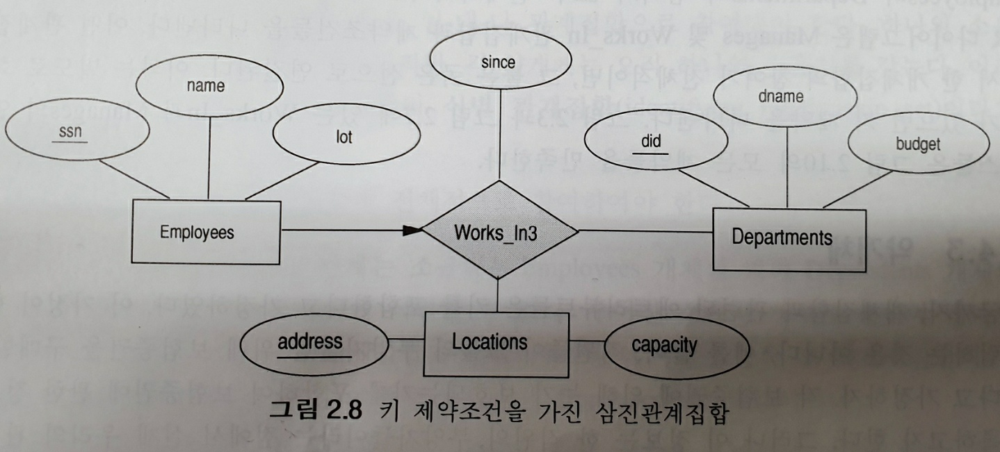
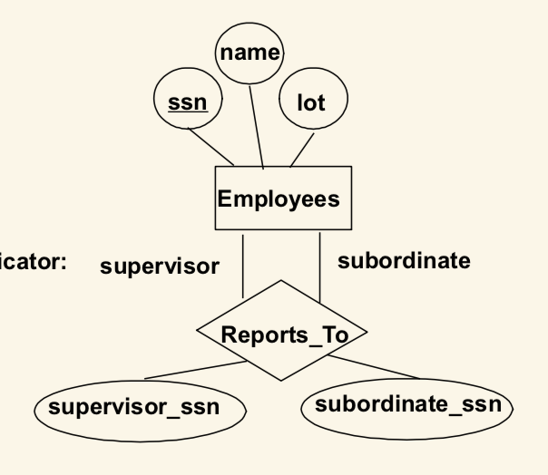
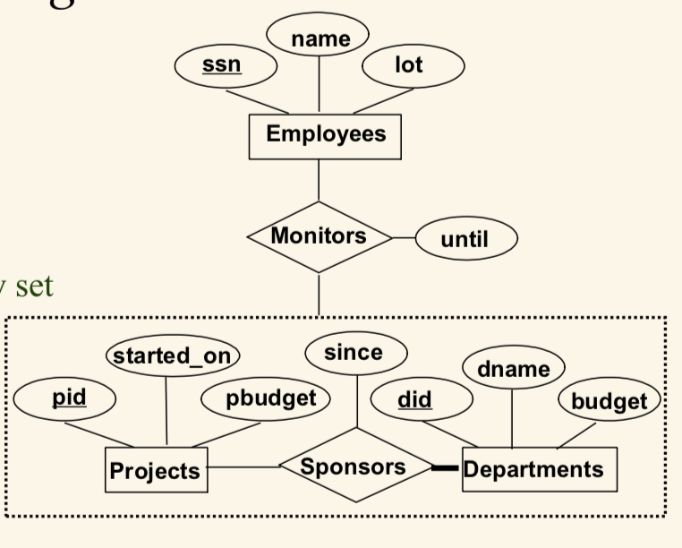

# 데이터베이스 설계의 개요 (ER DIAGRAM)

* 2.1 데이터베이스 설계와 ER 다이아그램
    - 요구분석 (rquirement analysis)
        + 무엇을 DB에 저장할지 어떤 응용을 얹을지, 어느 연산들이 가장 자주 수행되며 성능 요건을 파악하는 일.
    - 개념적 데이터베이스 설계 (conceptual database design)
        + 요구분석에서 나온 정보들을 토대로 제약조건들을 만든다.
        + ER 모델을 이용, 데이터의 제약조건들과 관계를 간단하게 하지만 충분히 정확하게 기술한다.
    - 논리적 데이터베이스 설계(logical database design)
        + 적합한 DBMS 선정
        + ER 다이아그램, 개념적 설계를 바탕으로 스키마 생성
    - ER 설계 이후의 단계들
        + 스키마 정제 (schema refinement)
            - 관계 DB 스키마에서 관계, 릴레이션들을 분석, 문제점을 파악하고 정제. *정규화*
        + 물리적 데이터베이스 설계 (physical database design)
            - 예상 작업량을 고려, 성능에 맞는 DB 구축
            - 테이블 인덱싱, 클러스터링
        + 응용 및 보안설계
            - 응용에 관계되는 개체들과 프로세스들을 파악
            - 각 역할별 접근 권한 부여
* 2.2 개체, 애트리뷰트, 개체집합
    - 개체(entity)
        + 실세계에서 다른 객체들로부터 구분될 수 있는 객체, 
            - 장난감 회사, 장난감 부서, 관리자, 집 주소 등등
    - 개체 집합(entity group)
        + 이러한 비슷한 개체들끼리 모아놓은 것들
    - 애트리뷰트(attributes)
        + 같은 개체집합 안의 개체들은 같은 애트리뷰트를 갖는다.
        + 속성값
    - 도메인 (domain)
        + 애트리뷰트들의 속성값? int char 등의 길이
    - 키 (key) unique identifier
        + 한 집합에서 각 개체들을 유일하게 식별하는 애트리뷰트들의 최소집합
        + candidate key 
            - 이러한 식별자들, 기본키, primary key의 후보들임
            - 물론 이것들로 구별이 가능하지만 최소 집합이 아니기에 후보임
* 2.3 관계와 관계집합
    - 기술적 애트리뷰트
    - 관계집합에 붙은 애트리뷰트
        + 하지만 그 관계로 이어진 개체들의 primary key 의 구분으로 이게 업데이트가 될지 버티고 남을지가 구분됨.
    - </img>
            + 각 Works_In 관계는 직원의 ssn과 부서의 did의 조합에 의하여 유일하게 식별되어야 한다. 그러므로, 어떠한 직원-부서 쌍에 대해서도 하나 이상의 since 값을 가질 수 없다.
    - **??????? 그러면 이렇게 짜인 er로는 테이블을 어떻게 짤까??**
* 2.4 ER 모델의 특별한 기능
    - 키 제약조건 (key constraint)
        + 개체집합 사이의 관계집합에 대한 제약
        + 전체 참여
            - 한 직원이 여러 부서, 한 부서에 여러 직원, 그냥 - 작대기, 
            (다-대-다, many to many)
        + 부분 참여
            - *한* 직원이 관리자로 *여러* 부서와 관련, 많아야 하나 -> 화살표 (일-대-다, ont to many)
            - *한* 직원이 *하나*의 부서*만* 관리, -> 화살표
            (일-대-일, one to one)
    - 참여 제약조건 (Participation Constraints)
        + 만약 모든 부서가 한사람에 의해 관리가 되어야한다?
            - 전체 참여
                
            - 부분 참여
            - 두꺼운 화살표
                + 모든 부서는 한사람에 의해 관리
            - 두꺼운 줄
                + 모든 부서에 모든 직원이 일한다
    - 삼진관계의 키 제약조건
        + </img>
        + 각 부서는 여러 직원 및 장소와 관련될 수 있고
        + 각 장소는 여러 부서 및 직원과 관련될 수 있지만
        + 각 직원은 하나의 부서 및 장소와 관련된다 **화살표!!!**
    * 참여 제약조건
        - 전체 참여 (total participatient)
            + 어떤 관계집합에서 한 개체집합의 참여가 전체적이면
            + **굵은 선**
            + 키 제약조건이 있으면 **화살표**
        - 부분 참여 (partial participatent)
            + 
    * 약개체
        - 소유자 개체집합과 약개체집합은 일-대-다
        - 각 약개체는 *오직* 하나의 소유자
            + 식별 관계집합 (identifying relationship set)
        - 약개체집합은 식별 관계집합에 전체 참여
        - 관계집합, 약개체 둘다 굵은 박스
    * 클래스 계층
        - </img>
        - Hourly_Emps 와 Contract_Emps는 Employees로 *일반화*됨
        - ISA 계층은 *중첩 제약조건* 과 *포괄 제약조건* 명시
        - 중첩 제약조건 (overlap constraints)
            + ISA 밑에서 둘다 가능한 개체가 있으면
            + Hourly_Emps **OVERLAPS** Contract_Emps
        - 포괄 제약조건 (covering constraints)
            + 서브클래스 어디에도 속하지 않는 경우
            + Hourly_Emps AND Contract_Emps **COVER** Employees
    * 집단화
        - 개체을의 모임과 관계들의 모임간에 관계
        - when to use?
            + 관계들 사이의 어떤 관계를 표현할때
        - </img>
    * DBDudes
        - d2 : 만약 한 고객이 같은 책을 하루에 두 번 주문하면?
        - d1 : 첫 번째 주문은 새로운 Orders 관계를 생성, 둘째는 값을 갱신
        - d2 : 만약 한 고객이 하루에 서로 다른 책을 두번 주문
        - d1 : 아무런 문제 ㄴ, Orders 관계집합의 각 인스턴스는 그 고객과 각각의 다른 책을 관련짓는다
        - d2 : 한 고객이 다른 날 같은 책을 두번 주문하면?
        - d1 : 그 두 주문을 구별하기 위해 주문날짜를 사용
        - d2 : ㄴㄴ, 그거 안됨, Customers와 Books의 애트리뷰트들이 결합하여 Orders에 대한 키를 포함해야한다. 

        - Orders의 구별은 무조건 isbn과 usrid로만 구분이 되니 불가능, 그러면 모든 어트리뷰트를 pk 로 등록, ㄴㄴ -> 질의를 할때 모든 어트리뷰트들의 값을 지정해야함.
        - 위에 왜 안되는지 어떻게 해야하는지 **꼭!!!** 확인
    