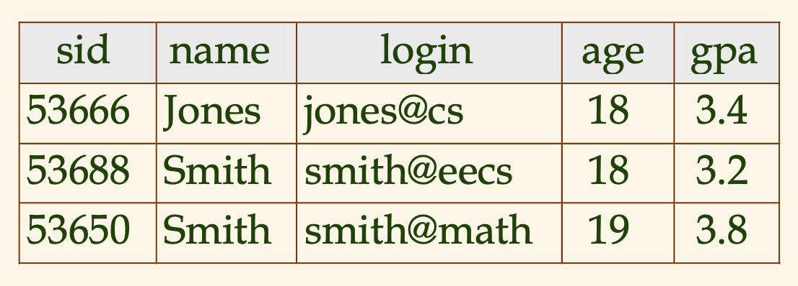

# 복습문제
* 릴레이션이 무엇인가? 릴레이션 스키마와 릴레이션 인스턴스의 차이점을 설명하시오. 릴레이션의 용어 arity와 degree를 정의하시오. 도메인 제약조건이 무엇인가?
    - 릴레이션 이란?
        - 관계모델에서 데이터를 표현하는 주된 구성자
    - 릴레이션 스키마와 릴레이션 인스턴스의 차이점
        - 릴레이션 스키마
            - 해당 릴레이션의 각 필드의 속성 값들을 명시하는 스키마
        - 릴레이션 인스턴스 
            - 해당 릴레이션 스키마를 통해 입력된 데이터들, 튜플들, 레코드들을 말한다.
    - 릴레이션 arity
        - The set of all relations in a database is called the signature of the database. Signatures are always finite. The arity of a relation is the number of objects involved in any instance of that relation.
        - ???
    - 릴레이션 degree
        - 필드들의 수
    - </img>
        - degree = 5, cardinality = 3
    - 도메인 제약 조건?
        - 그 릴레이션의 각 인스턴스가 만족해야하는 중요한 조건을 명시
* 릴레이션의 정의를 가능하게 하는 SQL의 구성자는? 릴레이션 인스턴스의 수정을 허락하는 SQL의 구성자는?
    - 릴레이션의 정의를 가능하게 하는 SQL의 구성자는?
        - CREATE TABLE NAME ( sid CHAR(20), etc ,, )
    - 릴레이션 인스턴스의 수정을 허락하는 SQL의 구성자는?
        - UPDATE student FROM student.sid WHERE student.rating > 3;
    - DELETE  FROM student WHERE student.sname = 'Smith';
    - INSERT INTO student (sid, sname, rating) VALUES ( ('1', 'john', '23') );
* 무결성 제약조건이 무엇인가? 기본키 제약조건과 외래키 제약조건을 정의하시오. 이 제약조건들은 어떻게 SQL로 표현되는가? 어떤 다른 종류의 제약조건들을 SQL로 표현할 수 있는가?
    - 무결성 제약조건이 무엇인가?
        - 적합한 조건을 통과한 데이터들, sid CHAR(20), rating INT 이런식으로 명시한것
    - 기본키 제약조건과 외래키 제약조건을 정의하시오.
        - sid CHAR(20), rating INT 이런식으로 명시한것 애초에 스키마 짤때 해당 인스턴스가 만족해야할 키 제약조건
        - 외래키는 FOREIGN KEY (studid) REFERENCE Student 이런식으로 외래키를 어디에서 받아와서 해당 인스턴스에 어떤 필드에 저장할지 명시하고
        - NULL 값이 들어올수 있는지, 명시
    - 어떤 다른 종류의 제약조건들을 SQL로 표현할 수 있는가?
        - 특정 필드의 값들을 제한, 18세 이상, rating이 3.4 이상, 이런식
        - 테이블 제약조건
            - 단일 테이블에 대한 조건, 수정될 때마다 검사
        - 단언 
            - 여러 테이블에 대한 조건, 이중 한 테이블이 수정될 때마다 검사
* 제약조건들이 위배될 때 DBMS는 무엇을 하는가? 참조 무결성이 무엇인가? SQL은 참조 무결성의 위배를 처리하기 위해 응용 프로그래머에게 어떤 옵션들을 제공하는가?
    - 제약조건들이 위배될 때 DBMS는 무엇을 하는가? 
        - 도메인, PRIMARY KET, UNIQUE 등의 제약 조건을 위배할시 명령은 거부,
        - 실행하는 트랜잭션의 마지막까지 연기(defer)될 수 있다.
    - 참조 무결성이 무엇인가?
        - 외래키에 해당하는 무결성,
        - 참조하는 FOREIGN KEY 에 해당하는 no action 이나 참조가 불가능 한 경우
    - SQL은 참조 무결성의 위배를 처리하기 위해 응용 프로그래머에게 어떤 옵션들을 제공하는가?
        - ON DELETE CASCADE
        - ON UPDATE NO ACTION
        - ON UPDATE 
* 언제 무결성 제약조건들이 DBMS에 의해 집행되는가? 응용프로그래머는 어떻게 트랜잭션이 실행되는 동안 제약조건 위배 여부가 검사되는 시점을 제어하는가?
    - 언제 무결성 제약조건들이 DBMS에 의해 집행되는가?
        - 각 SQL 문의 마지막에 검사, 위배? 거부
        - 만약 순환참조 처럼 서로 각기 서로의 테이블을 참조하여 insert?
    - 응용프로그래머는 어떻게 트랜잭션이 실행되는 동안 제약조건 위배 여부가 검사되는 시점을 제어하는가?
        - SET CONTRANINT ConstraintFoo DEFERRED
            - constraint 이름을 명시해주어 해당 제약조건을 *지연*
* 관계 데이터베이스의 질의는 무엇인가?
    - 여러개의 테이블에서 특정 조건을 만족시키는 새로운 릴레이션으로 구성.
    - SELECT * FROM Student AS S WHERE S.age > 28;
* 테이블을 생성하기 위해 어떻게 ER 다이어그램을 SQL 문으로 변화할 수 있는가? 어떻게 개체집합이 릴레이션으로 사상되는가? 관계집합은 어떻게 사상되는가? ER 모델에서 제약조건, 약개체집합, 클래스 계층, 집단화가 어떻게 처리되는가?
    - 테이블을 생성하기 위해 어떻게 ER 다이어그램을 SQL 문으로 변화할 수 있는가?
        - 개체집합을 테이블로
            - CREATE TABLE Employees ( ssn CHAR(11), name CHAR(30) etc)
        - (제약조건이 없는) 관계집합을 테이블로
            - CREATE TABLE Works_In( ssn CHAR(22), did INT, PRIMARY KEY(ssn, did), FOREIGN KEY (ssn) REFERENCES Employees(ssn), )
            - 포린키 넣고 프라이머리키 설정 이런듯
        - 키 제약조건이 있는 관계집합을 테이블로
            - 위와 같음, 하지만 릴레이션을 더 잘 보고 새로운 필드를 더 만든다, 가령, manager_ssn, employee_ssn 이런식으로
        - 참여 제약조건이 있는 관계집합의 변환
            - CREATE TABLE Dept Mgr ( did INT, dname CHAR(20), ssn CHAR(11) NOT NULL, PRIMARY KEY (did), FOREIGN KEY (ssn) REFERENCES Employees ON DELTE NO ACTION)
                - 각 부서는 반드시 관리자가 있어야 한다는 참여 제약조건을 표현
                - ssn이 널값을 취할 수 없으므로 Dept_mgr의 각 투플은 Employees에 있는 한 투블(관리자)을 식별한다.
        - 약개체집합의 변환
            - 각 보험은 한명의 직원에 의해 관리 되어야하니깐 PRIMARY KEY 로 ssn 이 들어가고 FOREIGN KEY 로 Employees로 주고 ON DELETE CASCADE 하면 약개체 집합 표현 가능
        - 클래스 계층
            1. ISA 관계에서 서브 클래스들이 모두 포함되는 경우
                - 각각을 새로 테이블로 짜주고 FOREIGN KEY 로 하면 됨
            2. ISA 관계에서 서브 클래스들 말고 존재하는 경우
                - 둘다 해당 되지 않고 존재하려면 DB에 저장이 불가능( 그걸 나타내는 테이블 ㄴ )
                - 각각의 서브클래스들의 조회는 가능
        - 집단화
            - 집단과의 관계가 모두 포함하는 관계라면 집단 내에서의 관계는 사라질 수 있다.
            - 하지만 모두 감독하는것이 아니라면 집단 내에서의 관계에 대한 테이블이 필요
* 뷰는 무엇인가? 뷰는 어떻게 논리적 데이터 독립성을 지원하는가? 보안을 위하여 뷰는 어떻게 사용되는가? 뷰에 대한 질의는 어떻게 계산되는가? 왜 SQL은 갱신될 수 있는 뷰의 클래스를 제한하는가?
    - 뷰는 무엇인가?
        - 일종의 테이블로서 이에 속해있는 행들이 실제로 데이터베이스에 저장되지 않고 뷰 정의 (view definition)를 통해서 필요한대로 계산
    - 뷰는 어떻게 논리적 데이터 독립성을 지원하는가?
        - 사실상 뷰는 릴레이션에 직접 관계되는게 아니라, 저장된 릴레이션의 스키마가 변경되면 그 변경 사항이 바로 계산되어 재정의 되어 보여지므로 원래의 스키마를 사용하고 있던 응용들은 새로운 뷰를 통해 사용이 되므로 논리적 데이터 독립성을 지킨다.
    - 보안을 위하여 뷰는 어떻게 사용되는가?
        - 뷰를 통하여 원하는 정보를 볼 수 있지만, 해당하는 테이블 전체를 볼 수는 없게 할 수 있기에 보안을 유지할 수 있다.
    - 뷰에 대한 질의는 어떻게 계산되는가?
        - 몰라 씨발
    - 왜 SQL은 갱신될 수 있는 뷰의 클래스를 제한하는가?
        - 만약 뷰에서 어떤 하나를 없애고자 하면 그게 연동된 테이블에서의 놈을 없애야하는데, 그러면 그게 원하는 결과가 아님, 뷰는 뷰일뿐, 그렇기에 불허
        - 만약 뷰에서 어떤 하나를 추가하고자 한다면, 연동된 테이블 각각에 특정 튜플을 삽입해야하는데, 뷰에서 필요한 어트리뷰트들과 해당 참조 당하는 테이블에서의 어트리뷰트들이 다를 수 있기에 챰죠 댱하는 테이블에 null 값이 들어갈 수 있고, 이렇기에 매우 복잡하고 불필요하게 제한적이다.
* 테이블의 구조를 수정하고 테이블과 뷰를 제거하기 위한 SQL 구성자는 무엇인가? 뷰를 제거할 때 어떤 일이 일어나는지를 논의하시오.
    - 테이블의 구조를 수정하고 테이블과 뷰를 제거하기 위한 SQL 구성자는 무엇인가?
        - DROP TABLE students RESTRICT
            - 해당 테이블이 어떤 뷰나 무결성 제약조건이 없다면 가능
        - DROP TABLE students CASCADE
            - 해당 테이블의 제약 조건에 따라 몽땅 연결된 애들 없애줌
        - DROP VIEW
            - 뷰에 해당하는 똑같음,,
        - ALTER TABLE students 
            - 테이블 제약조건이나 어트리뷰트들 바꿔주는거
