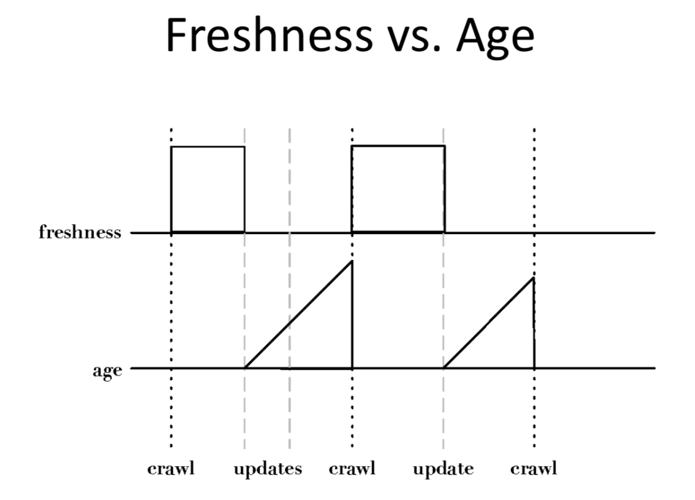

# Information Retriever
* Web Crawler
    - </img>
    - Crwal sequence
        - DNS -> hostname -> IP address -> port -> HTTP request, GET request
        - seeds, URLs
        - URL request(seeds) -> queue
        - fetching pages from reqeust queue
        - parse downloaded pages to get useful URLs to fetch -> queue
        - while(!queue() && !newURL)
    - avoid waiting response time  
        - threads
    - *politeness policies*
        - 어딜 가도 좋고 어딘 안되고
        - Robots.txt
        - </img>
* Freshness
    - crwaler must continually revisit pages
    - </img>
    - 현실적 불가
        - can lead to bad decisions, not crawling popular sites
    - *Age* is better metric
* Freshness vs Age
    - </img>
    - </img>
    - Older a page gets, more it costs not to crawl it
* Focused Crawling
    - Focused on topic
    - pages tend to have links on the same topic
    - *text classifier* to decide whether a page is on topic
* Deep Web
    - hidden web
    - private sites
        - no income links, valid account
    - form results
        - input data to enter
    - scripted pages
        - js, flash, flient-side languages to generate links
* Sitemaps
    - lists of URLs
    - data of URLs, modificaiton time modification frequency
    - </img>
        - lastmod tag
* Distributed Crawling
    - why use?
        1. help crawler closer to sites it crawls
        2. reduces # of sites to crawl
        3. reduces computing
    - use Hash function
        - hashing for urls
* Desktop Crawls
    - 데스크탑 내에서 크롤
    - eaier than web
    - response fast
    - various doc format
    - data privacy
* Document Feeds
    - most docs are published
        - created at a fixed time, rarely updated
    - Two types
        1. push feed alerts
            - telephone
        2. pull feed requires
            - email
    - Most common format for pull feeds
        - RSS
        - Really Simple Syndication, RDF Site Summary, Rich Site Summary
        - <ttl>60 </ttl> time to live = 60min =more than an hour means stale
* Conversion
    - Typical tool
        - HTML, XML
* Character Encoding
    - character -> bits & gltphs
    - ASCII
        - 128 letters, numbers, sepcial characters, 
        - 7 bits for control characters
* Unicode
    - mapping between numbers & glyphs
    - 1 byte -> eng
    - 4 byte -> chinese
    - UTF-32 -> internal text (fast random lookup)
    - UTF-8 -> disk sotrage (less space)
    - </img>
        - 앞에부터 늘면 1이 더 붙음
* Storing the Docs
    - Advantage
        - crawling time 절감
        - efficient access
* Large Files
    - docs를 나눠 저장 ㄴ, in one large file
        - overhead 절감
        - seek time 절감
* Comperssion
    - Text redundat 때문에 압축 ㅅㅌㅊ
* BigTable
    - No query
    - row-level transactions
    - 분산 시스템
    - record transaction log, shared file system, for server down
    - </img>
    - inverted hash table(from os) 비슷
* Duplicate Detection
    - Checksum technique
        - 각 글자들의 value 값을 다 더함
        - </img>
    - Near-Duplicate Detection
        - doc D1, doc D2 비교, by Near-Duplicate
        - Search : O(N) -> IR 
        - Discover : O(N^2), fine all pairs
* Fingerprints
    1. doc parsing
    2. words grouped into *n-grams* (series of words)
    3. some *n-grams* represent docs
    4. selected *n-grams* hashing -> improve IR efficiency
    5. docs compare by fingerprints
    - </img>
* Simhash
    - word-based sim & fingerprints efficiency
    1. weighting by frequency
    2. *b* bit(desired size of fingerprint) each word ->  unique hash value for word
        - ascii code multiply all the char in word, divide by 256 to make 8 bit hash 
        - **to make faster, multiply first char and the last char**
    3. 1이면 더하고 0이면 빼는데 각 word의 자리에 맞춰서 weight랑 곱해서 처리
    4. 8bit 중에서 positive 면 1 negative 면 0 으로 V vector 설정
    - </img>
* Removing Noise
    - adds, links, pics, 
    - detect content block
    - 중요 content에는 tag가 적다 는 아이디어에 착안
    - </img>
        - plateau
    - </img>
        - **이해 안됨,,,,,**