# Information Retriever
* Processing Text
    - Converting docs -> index terms
        - not well
        - not clear
* Text Statistics
    - Ranking algorithms
        - collection 에 많이 나오면 감점, 없으면 굳
    - Zipf's Law
        - 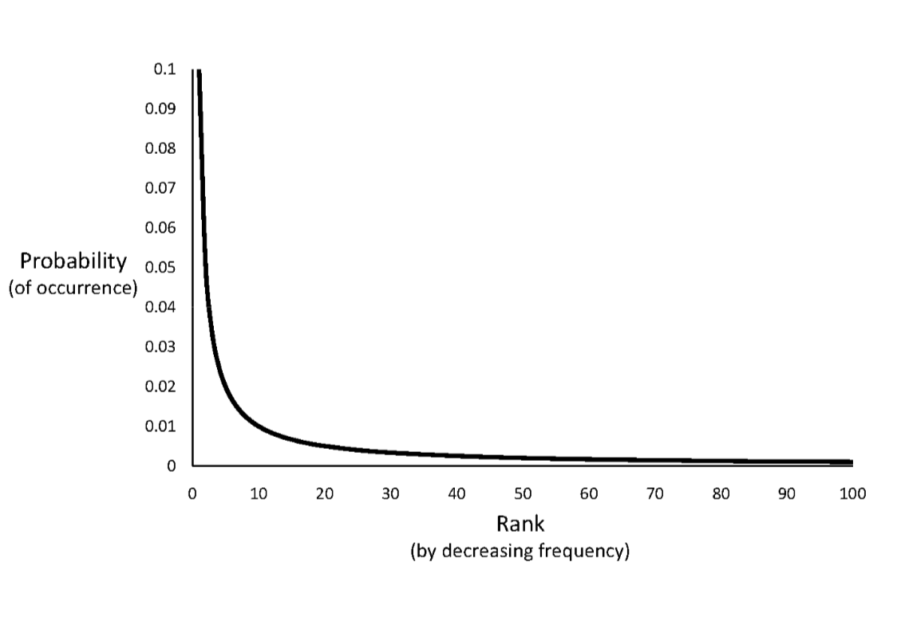</img>
        - </img>
            - ranking of word : Rn = k/n (k is const)
            - 모르겠다 이건,,
    - Vocab Growth
        - Heap's Law
            - corpus -> 구조화된 텍스트 집합
            - v = k.n^beta - beta = 1/root(2) 약 0.5; 10 <= k >= 100; n == # of words in copus; v == vocab size (중복없는 단어 집합)
            - TREC collection(10,000,000) -> unique words(100,000) 약 루트값으로 나옴
            - 큰 collection 에서 unique 한 단어들 뽑아 내면 루트값 정도의 숫자 나옴
            - 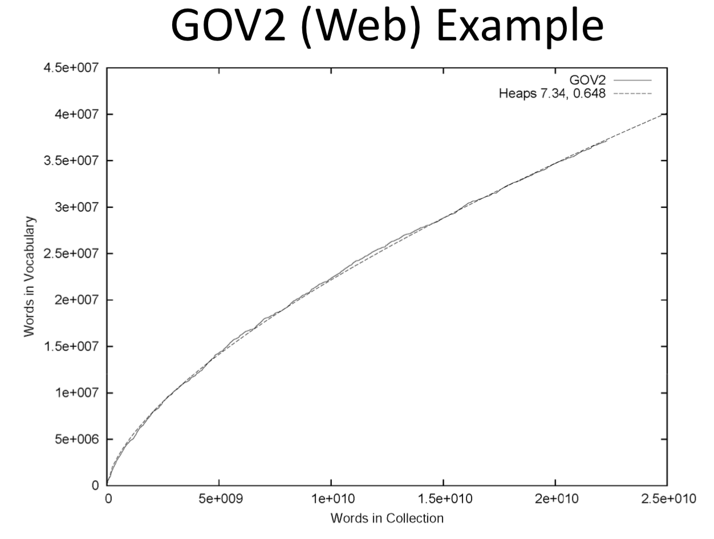</img>
        - Web Example
            - Estimating Result Set Size
                - f_abc = N * f_a/N * N * f_b/N * N * f_c/N = (f_a * f_b *f _c) / N^2
                - tropical fish aquarium 이라면
                    - troplical 만 쳤을때 몇개 나오나
                    - fish 몇개 나오나
                    - tropical fish 몇개 나오나 
                    - 이런식으로 나오는 갯수 파악하면 전체 사이즈 파악 가능
                - **하지만 이러면 서로 단어들이 independent 해야한다는 가정**
                - 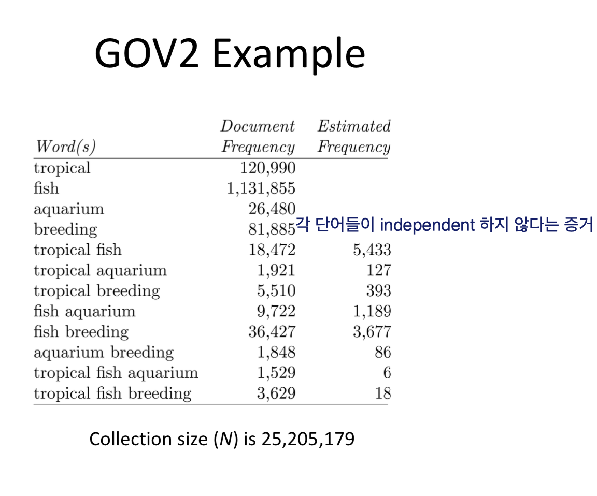</img>
            - Result Set Size Estimation
                - co-occurrence information 
                - 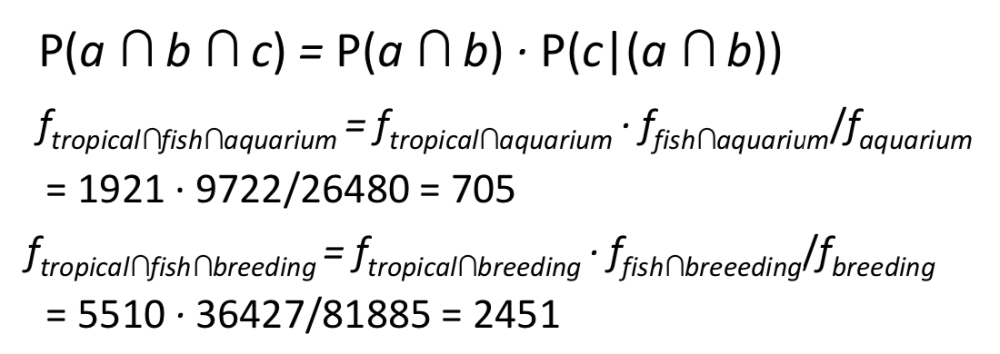</img>
                
                - Estimating with initial result set
                    - C/s ( s == total ranked doc size, C == docs contain all the query word)
                    - 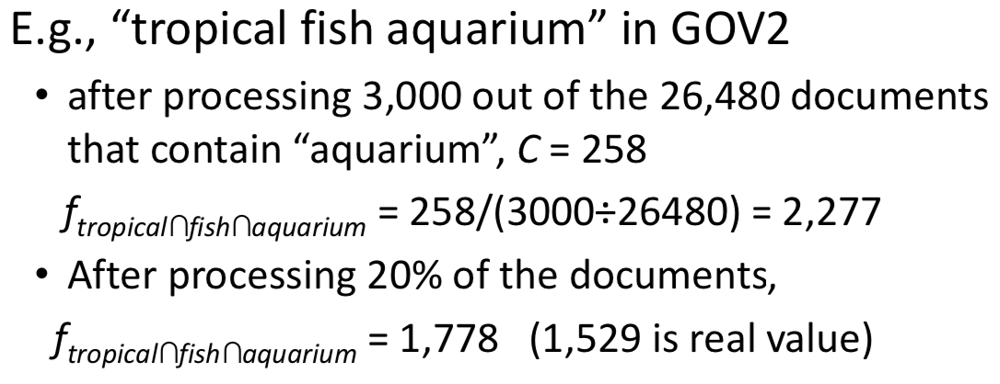</img>

                    - independence model
                    - 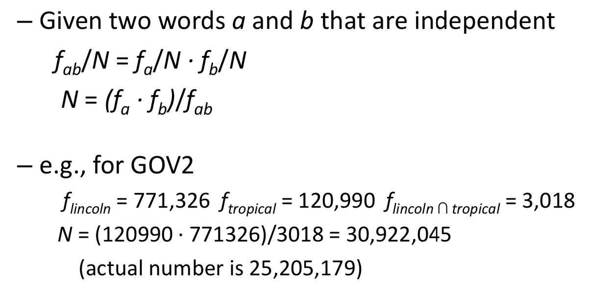</img>

                    - **DONT KNOW SHIT!!**

* **Tokenizing**
    - Example
        - Bigcorp's 2007 bi-annual report showed profits rose 10% 
        - Tokenizing
        - Bigcorp's 2007 annual  report hsowd profits rose
    - Too much information lost
    - 숫자를 몽땅 하느니 짤라서 저장, 불러옴, 보통 4자정도? (wtf)
    - Process
        - 몽땅 소문자, 특정 문자, 띄어쓰기로 parsing
        - 몽땅 indexing 
        - example 
            - 92.3 -> 92 3
            - 92를 찾고 그 다음에 거기서 3이 92에 붙어있는거를 찾고, 결정을 미룸
    - Stopping
        - 이 단어 무시해도 돼?
        - a the an etc
        - Problem(can be important in combination)
            - "to be or not to be"
        - Creating from high-frequency words, or standard list
        - click can be a good stopword for anchor txt
        - Decision at query time, 몽땅 다 들고온다음에 쿼리 날라오면 결정
    - Stemming
        - inflectional(plurals, tenses) 어형변화, 굴절
        - derivational(verbs -> noun) 파생
        - 같은 의미 애들로 짤라주는거 (민주적인, 민주주의, 민주 etc)
        - removing suffixes
        - can be done at indexing time, of query processing(like stopwords)
        - 고립어 : 중국 티베트어, 변형ㄴ 조사, 접미사 ㄴ
        - 굴절어 : 인도 유럽어, 영어, had -> have
        - 교착어 : 우랄 알타이어, 조사를 명사에 붙혀(교착)주어 목적어 부사,
        - 한국어는 교착어지만 굴절어의 특성도 가짐

        - Two basic types
            - Dictionary-based: uses lists of ralted words
            - Algorithmic : uses program to determine related words
            
            - False negative = 맞는데 틀린거, 자격이 있는데 떨어진거
            - False positive = 10개를 찍었는데 다 맞아서 뭐 이런거
        - Algorithmic stemmers
            - siffix-s: remove 's' endings auuming plural
                - cats -> cat, lakes -> lake

        - Porter Stemmer
            - Alg stemmer (in 70s)
            - **Produces *stems* not *words***
            - errors,,, & hard to modify
            - 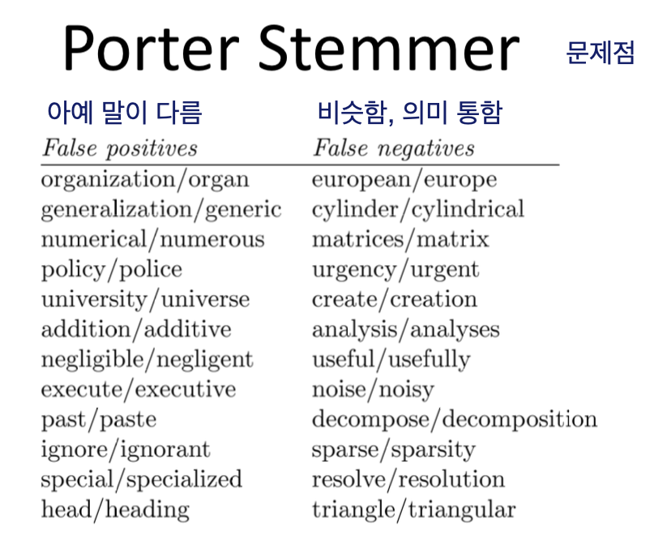</img>
        - Krovetz Stemmer
            - 장점 : 새로운 단어 만듬, not *stem*
            - false positive ㅜ lower , false negative ㅗ gets higher (내려가고 올라가고)
* Phrases
    - 보통 2-3 word phrases
    - More precise, Less ambiguous
    - Difficult for ranking
    - 3 Way
        - *Part-of-speech* 주어냐, 동사냐, 등등의 태그를 만듬
            - too slow
            - 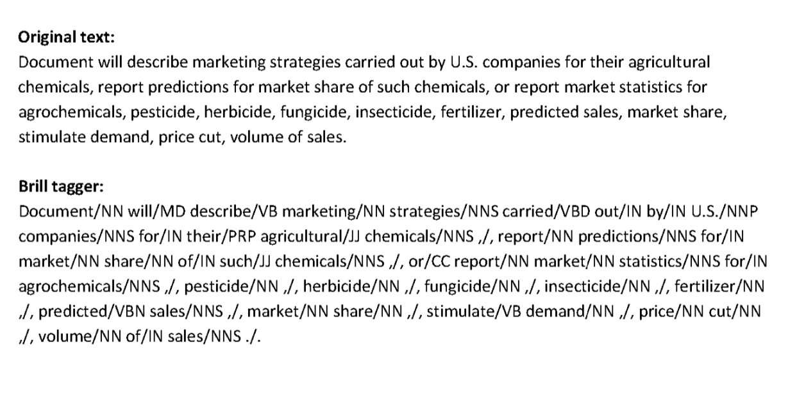</img>
        - *n-grams* n개의 연속된 단어들을 하나로 간주 (쉽고 무난)
            - frequent n-grams -> meaningful phrases
            - better fit to zipf's law than word alone
            - 단점 : more storage 
            - 구글 방식
        - *proximity operators* 거리에 따라 가까우면 같이 한 단어로 (word position)
* Docs structure and Markup
    - meta data,
    - tags
    - Links -> link analysis
* Link Analysis
    - <a href ="asdf">Anchor Text</a> 
    - Anchor Text
        - anchor text 를 한번에 한 테이블에 저장
    - Page Rank
        - Random Surfer Model
        - r = random(0-1)
        - if(r < ramda){
            go to random page
        }else{
            click a link at random on current page
        }
        - random surfer 가 들어올 확률 == page rank
    - Dangling Links
        - 무한 루프로 같은 페이지로 돌아오는 링크들
        - 링크가 아예 없는 애들
    - Page Rank
        - 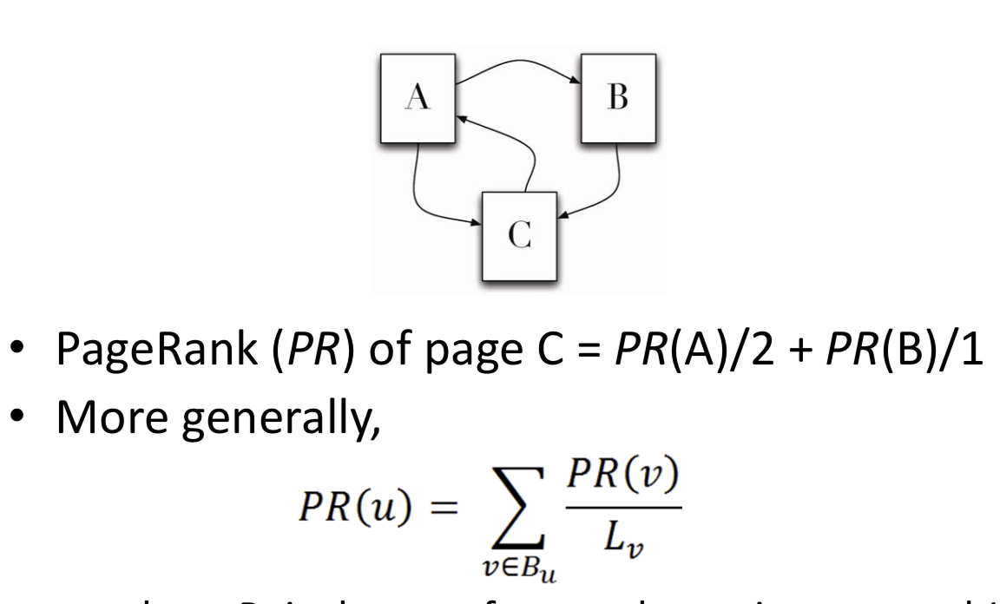</img>
        - C 입장에서 A에서 오고 가는게 2개 B는 1개니깐
        - Rank C = PR(A)/2 + PR(B)/1
        - 초기 값은 위의 경우에 3개니깐 1/3 으로 세팅
        - 계속 계산하다보면 특정값으로 수렴

        - 하지만 Random surf가 람다 값에 따라 밖으로 나가는 걸 설정해야하니
        - 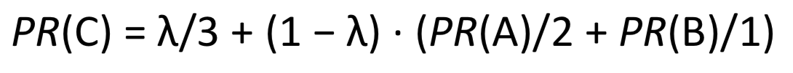</img>
* Link Quality
    - Link quality is affected by spam 
        - link farms (내 웹페이지에서 서로 내 페이지들을 가르쳐서 점수를 높힘)
        - traceback links (create loops)
        - 유명 웹페이지에서 내 웹페이지 링크를 퍼트림
* Information Extraction
    - Automatically extract structure 
        - tag
    - Named entity recognition
        - identifies words particular application
            - people, name, company, location etx
        - Rule-based
            - Uses lexicons(lists of words and phrases)
                - location, people's name, organization
            - <street address>, <city>, or in <city> to verify city
            - able to find new words of city etc,
        - Rules
            - By manual By machine learning
        - Statistical
            - probabilistic model
            - training data (manually annotated text)
            - **Hidden Markov Model(HMM)**
    - HMM
        - Resolve ambiguity
            - "marathon" for sport of location
        - Model context using *generative* model of sequence of words
            - Markov property: next word in a sequence depends on a previous words
        - 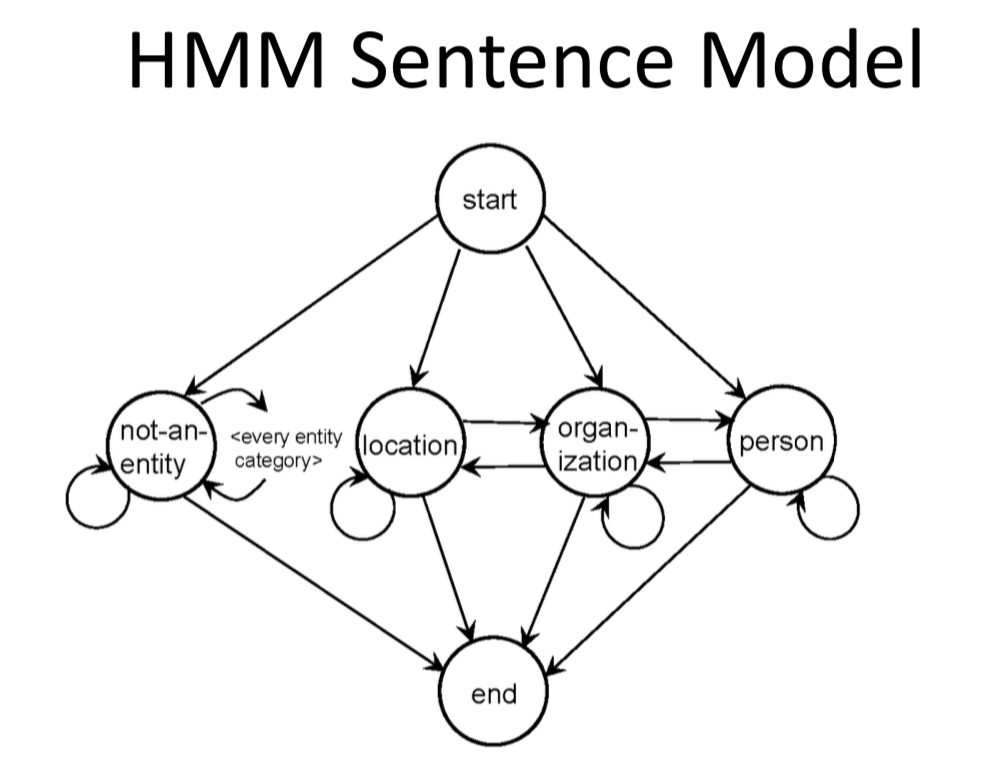</img>
        - To recognize named entities -> find sequence of "labels" that give *highest* probability for sentence
            - only outputs are visible
            - states are "hidden"
            - <start><name><not‐an‐entity><location><not‐ an‐entity><end>
            - Viterbi alg -> recognition
* Internationalization
    - Deal with multi languages
        - monolingual search : focus on one language/ but can deal with other languages
        - cross-language search : search in multiple languages at the same time
    - usually *language-neutral*
    - Major differences
        - Text encoding(-> Unicode)
        - Tokenizing(many languages have no word separators)
        - Stemming
    - Cultural differences -> UI/UX differences
