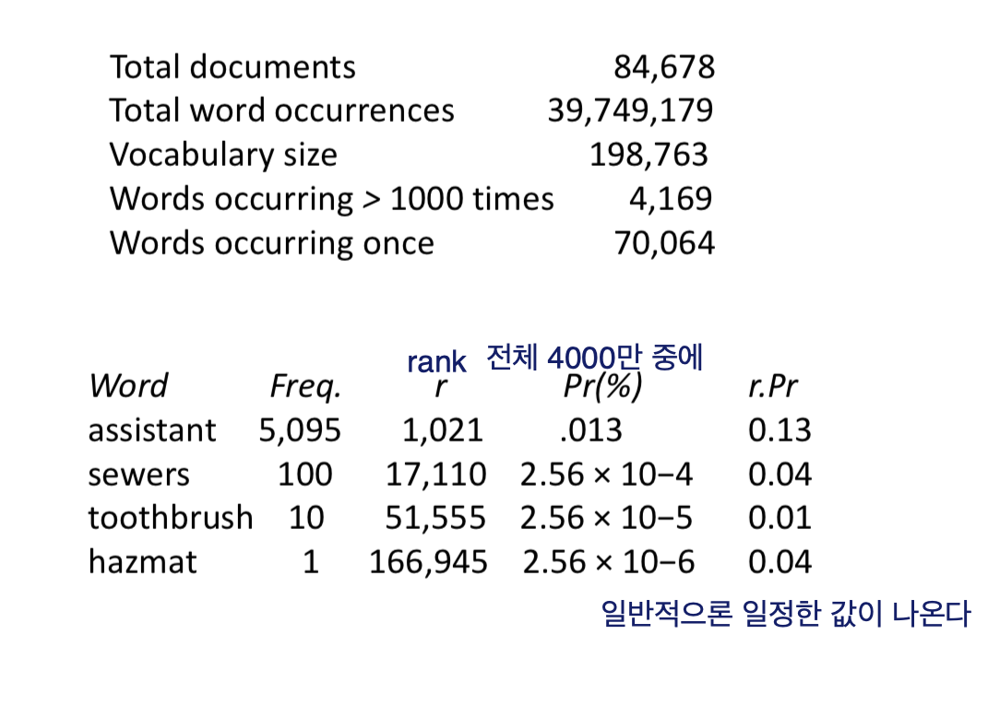

# Information Retriever
* Processing Text
- Converting docs )> index terms
    - not well
    - not clear
* Text Statistics
- Ranking algorithms
    - collection 에 많이 나오면 감점, 없으면 굳
- Zipf's Law
    - </img>
    - </img>
        - ranking of word : Rn = k/n (k is const)
        - 모르겠다 이건,,
- Vocab Growth
    - Heap's Law
        - corpus -> 구조화된 텍스트 집합
        - v = k.n^beta - beta = 1/root(2) 약 0.5; 10 <= k >= 100; n == # of words in copus; v == vocab size (중복없는 단어 집합)
        - TREC collection(10,000,000) -> unique words(100,000) 약 루트값으로 나옴
        - 큰 collection 에서 unique 한 단어들 뽑아 내면 루트값 정도의 숫자 나옴
        - </img>
    - Web Example
        - Estimating Result Set Size
            - f_abc = N * f_a/N * N * f_b/N * N * f_c/N = (f_a * f_b *f _c) / N^2
            - tropical fish aquarium 이라면
                - troplical 만 쳤을때 몇개 나오나
                - fish 몇개 나오나
                - tropical fish 몇개 나오나 
                - 이런식으로 나오는 갯수 파악하면 전체 사이즈 파악 가능
            - **하지만 이러면 서로 단어들이 independent 해야한다는 가정**
            - </img>
        - Result Set Size Estimation
            - co-occurrence information 
            - 

