# Information Retriever
* Indexes
    - inverted index / data structure
    - Indexes and Ranking
        - Indexes for search time
        - Search : Ranking
    - 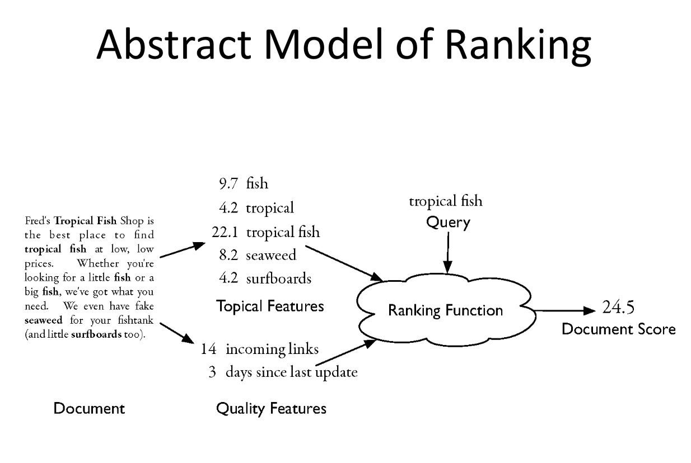</img>
    - 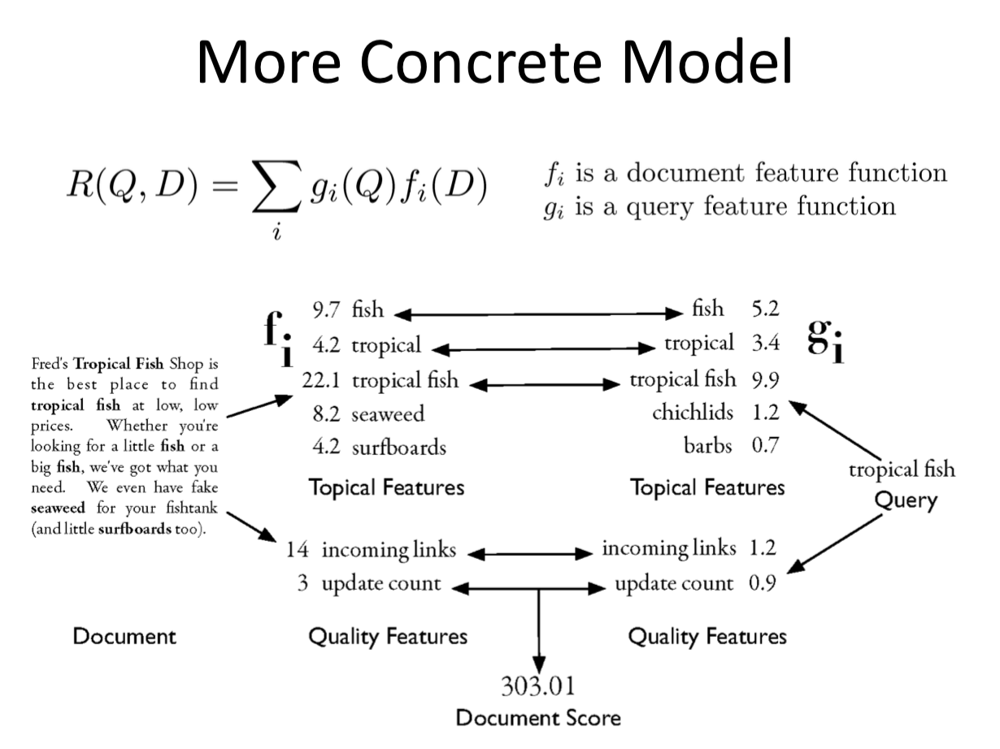</img>
* Inverted Index
    - lists of docs, lists of words, informations
    - *Posting* -> entry
    - *Pointer* -> posting 이 가리키는 문서 or 위치
    - each docs has number
    - *list* doc-ordered
* Collection
    - 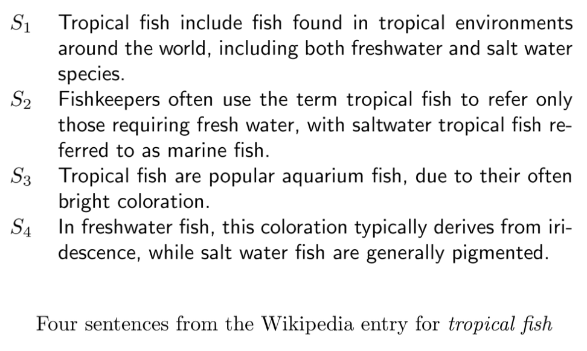</img>
    - 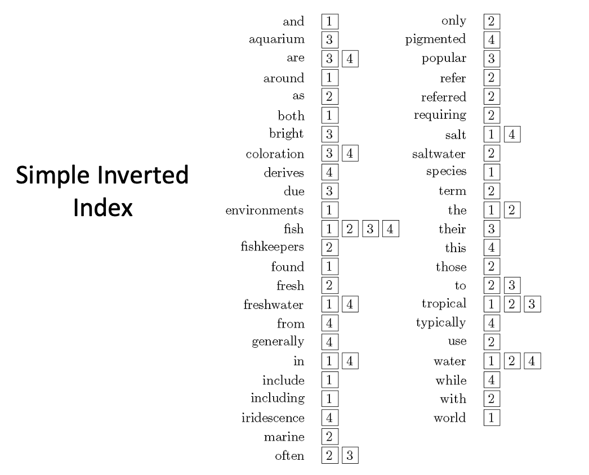</img>
    - 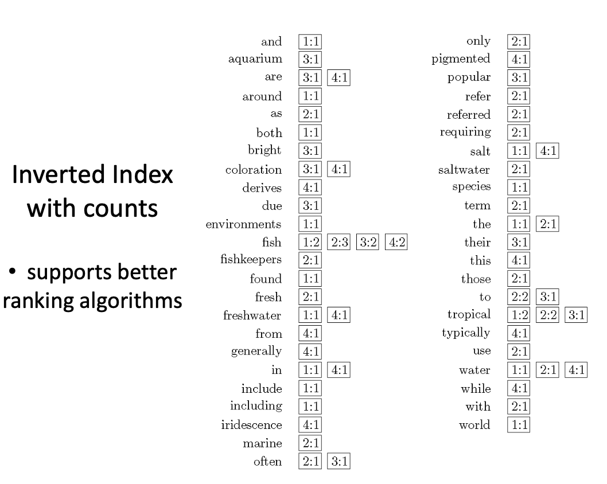</img>
    - 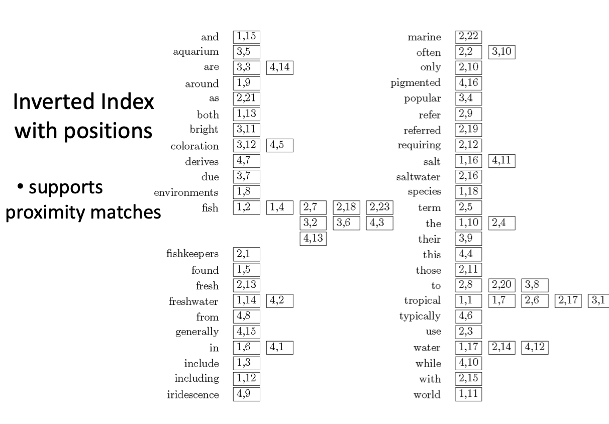</img>
* Proximity Matches
    - matching words by window size
        - tropical fish -> tropical within 5 words of fish
    - 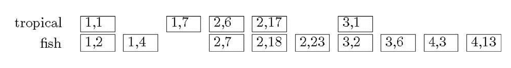</img>
* Fields and Extents
    - fields restrictions
        - date, from:, etx
    - more important field
        - title
    - option
        - inverted lists for each field type
        - add information about fields to postings
        - use *extent lists*
    - Extent Lists
        - with Extent lists, more information
        - 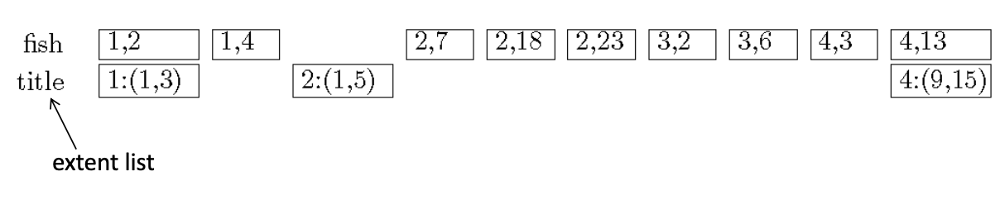</img>
    - Precomputed scores in inverted lists
        - e.g. fish [(1:3.6), (3:2.2)] // 3.6 is total feature value for doc 1
    - Score-ordered lists
        - for single-word queries
* Compression
    - Inverted lists are very large
        - if use *n-grams* super large
    - Basic idea
        - 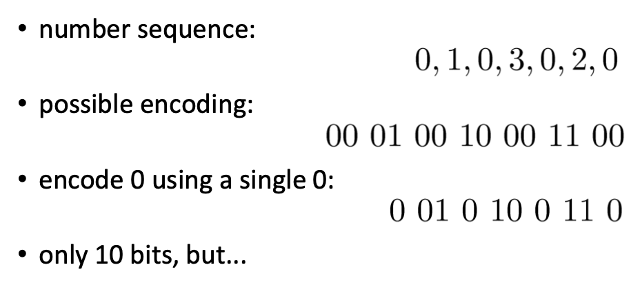</img>
    - Ambiguous encoding
        - 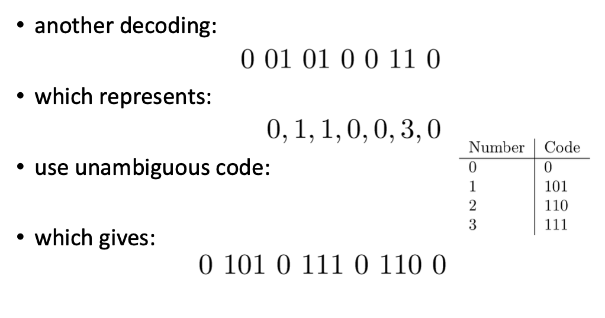</img>
    - **Delta Encoding**
        - 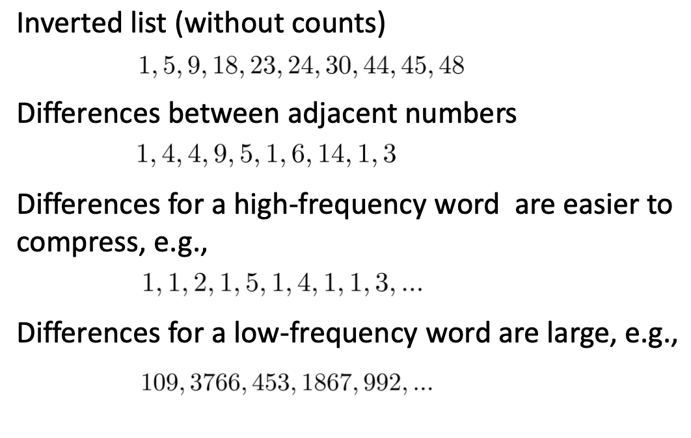</img>
        - Delta stands for offset // 앞에 숫자랑 얼마나 떨어져있나
        - thus many small nums, few large nums
    - **Bit - Aligned Codes**
        - 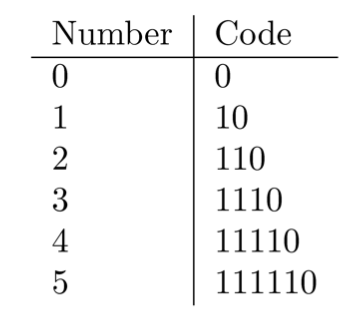</img>
        - 숫자 만큼 1 넣어줌
    - Unary and Binary Codes
        - binary -> 1023개 10bits, 
        - Unary -> 1023개 1024 bits
* Elias-y code
    - 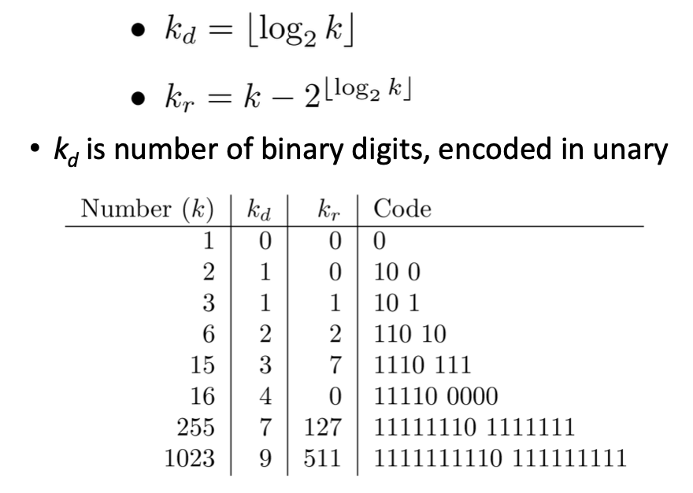</img>
    - 앞에 숫자 Kd는 log2 씌워서 버림 하고 나머지 Kr은 나머지에 대한 log2 해서 
    - 앞에 만약 7자리면 뒤에도 7자리
    - 앞에는 크기만큼 1주고 맨 뒤에만 0 줘서 끝나는 지점을 명시
    - in general 2(log2)버림 + 1 bit 필요
* Elias-g code
    - Elias -> unary code 를 줄인거
        - **1023 bit -> 19bit**
    - 2 log2 log2 k + log2 k  bit 필요
    - 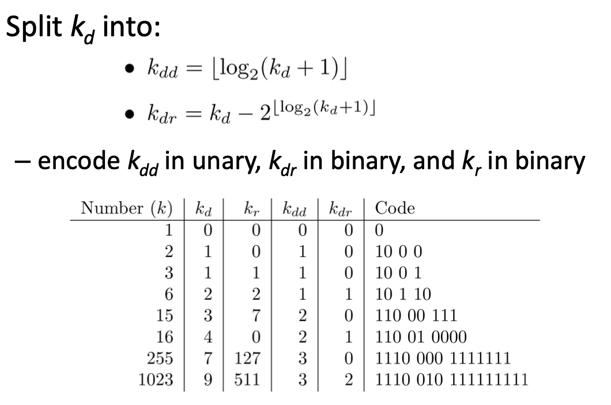</img>
        - elias-y 에서 몫을 한번더 log2 취한거
* V-Byte Encoding
    - 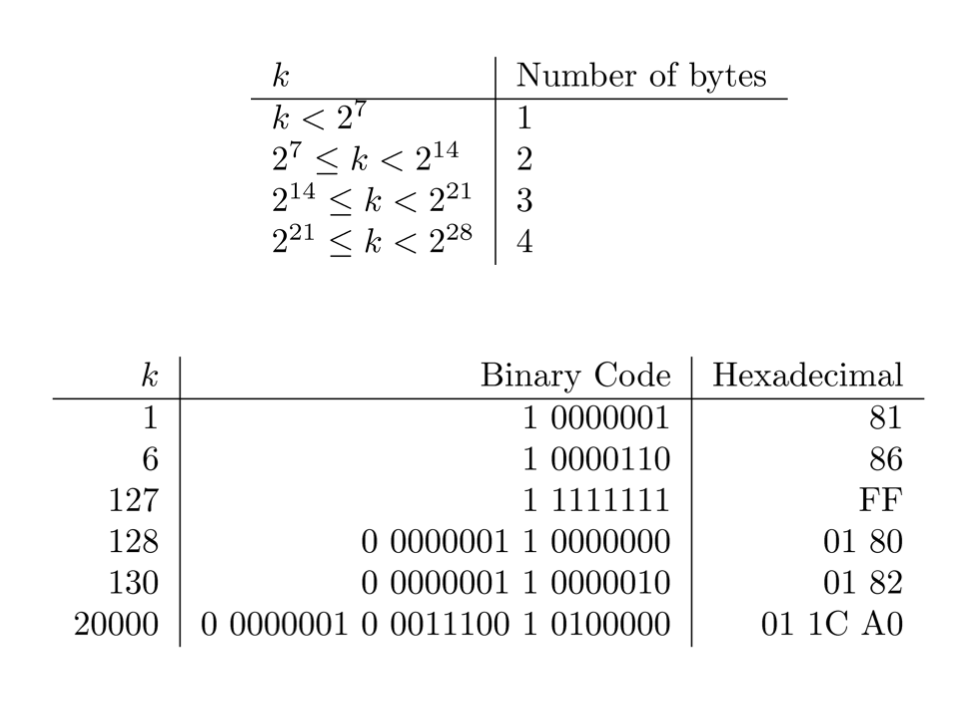</img>
    -   ```{.cpp}
            public void encode_V_byte(int[] input, ByteBuffer output){
                for(int i : input){
                    while( i >= 128){
                        output.put( i & 0x7F);
                        i >>>= 7;
                    }
                    output.put(i | 0x80);
                }
            }

            public void decode_V_byte(byte[] input, IntBuffer output){
                for( int i = 0; i < input.length; i++){
                    int position = 0;
                    int result = ((int)input [i] & 0x7F);

                    while( (input[i] & 0x80) == 0){
                        i += 1;
                        position += 1;
                        int unsignedByte = ((int)input[i] & 0x7F);
                        result |= (unsignedByte << (7*position)); 
                    }
                    output.put(result);
                }
            }
        ```
* Compression Example
    - 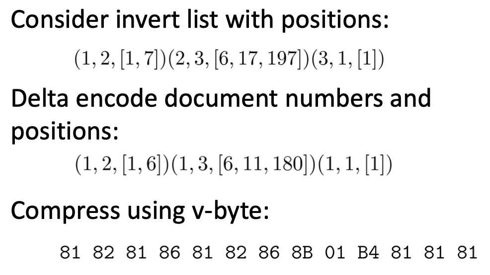</img>
* Skipping
    - 위에 compression 으로 다 해놓은걸 앞에서부터 delta 로 넘어가거나 linked list로 조질때 중간에 있는거나 뒤에 있는걸로 빨리 갈라고 만듬 
    - Skip Pointer
        - (d,p)
        - doc nums == d
        - byte(or bit) position == p
        - 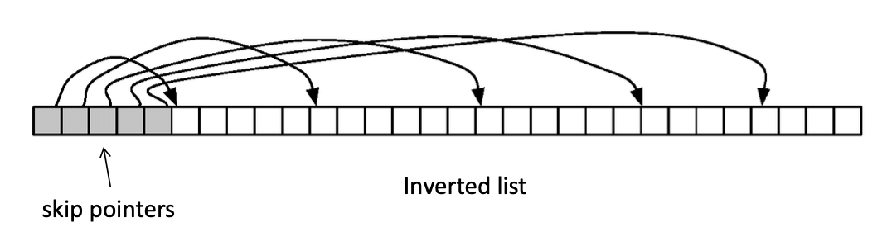</img>
        - 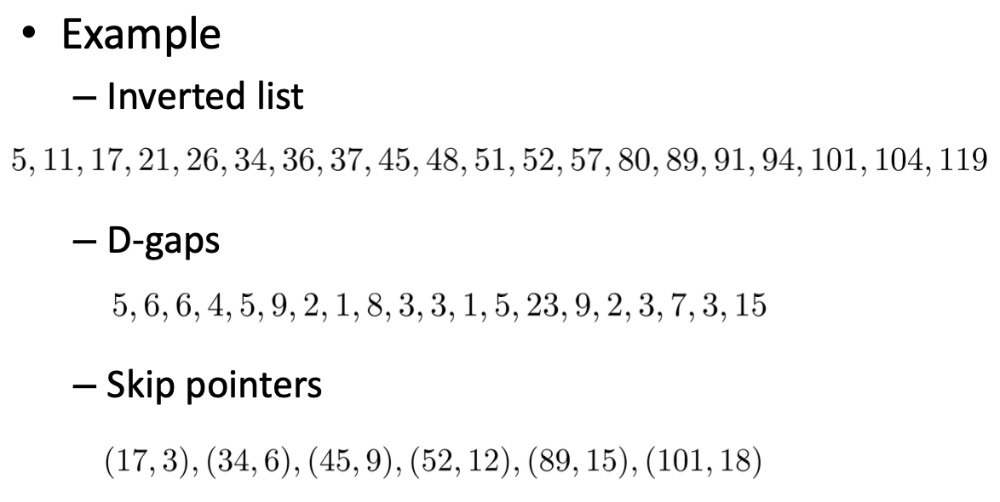</img>
* Auxiliary Structures
    - Inverted lists -> stored together in a single file for efficiency
    - Vocabs or lexicon
        - lookup table -> inverted hash table
        - Binary table
    - Term statistics
        - stored at start of inverted lists
    - Collection statistics stored in separate file
* Merging
    - 쪼개진 inverted lists를 한데 모으는 역할
    - 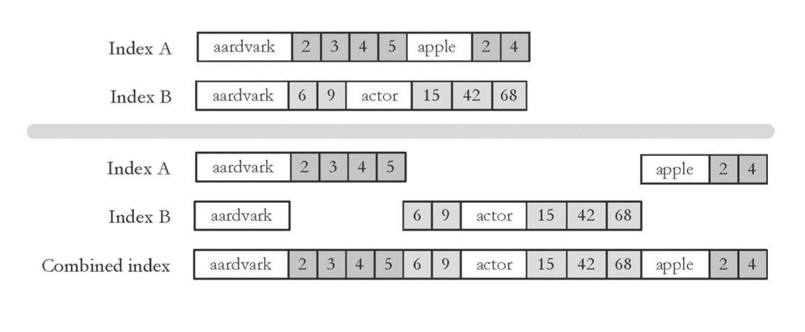</img>
* Distributed Indexing
    - web 에서 분산 되어 들어온 data를 수합
    - MapReduce is for indexing and analysis tasks
    - Credit card example 
        - using hashing table
        - each line of the file contains a credit card nums, amount of money
        - Determine the num of unique credit card nums
* MapReduce
    - Distributed programming framework that focuses on data placement and distribution
    - Mapper
        - transforms a list of items into another list of items of the same length
    - Reducer
        - list of items -> single item
    - on a cluster of machines
    - Basic process
        - Map stage
            - data into pairs (key,  value)
        - Shuffle
            - hashing the pairs
        - Reduce
            - records in batches, all pairs with the same key are processed at the same time
    - Idempotence of Mapper and Reducer provides fault tolerance
    - 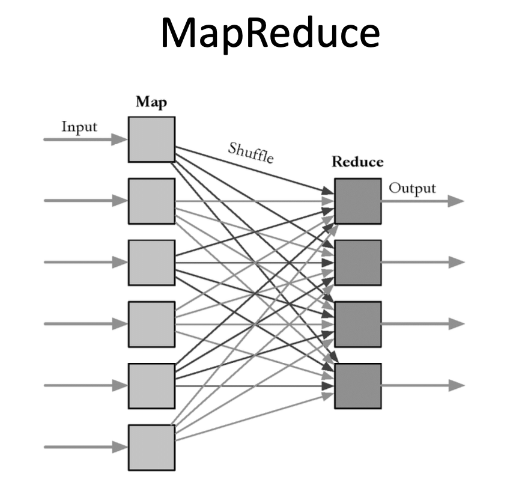</img>
        - 한곳에서 사고 다른데서 산 신용카드 정보를 map 하고 shuffle 해서 reduce 해서 한곳으로 모으는것
* Result Merging
    - Index merging 
        - handling updates when they come in large batches
        - 작은 규모의 update 는 불편
        - deletions handled using delete list
            - 신용카드 회사에서 결제 한거는 취소 할때 시간 두고 하는거
    - Query Processing
        - Document-at-a-time
            - Calculates complete scores for ducs by processing all term lists, 
            one doc at a time
            - 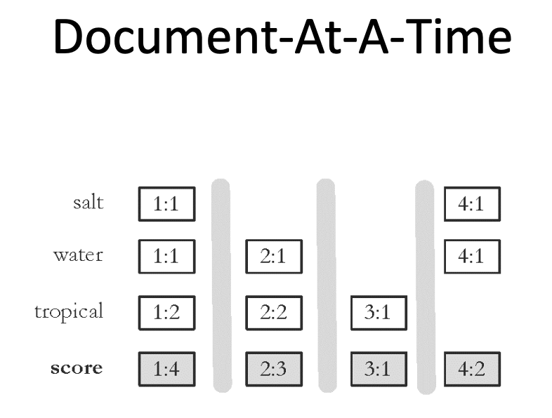</img>
        - Term-at-a-time
            - Accumulates scroes for doc by processing term lists ona at a time
            - 큰 문서집단에선 이게 유리
            - 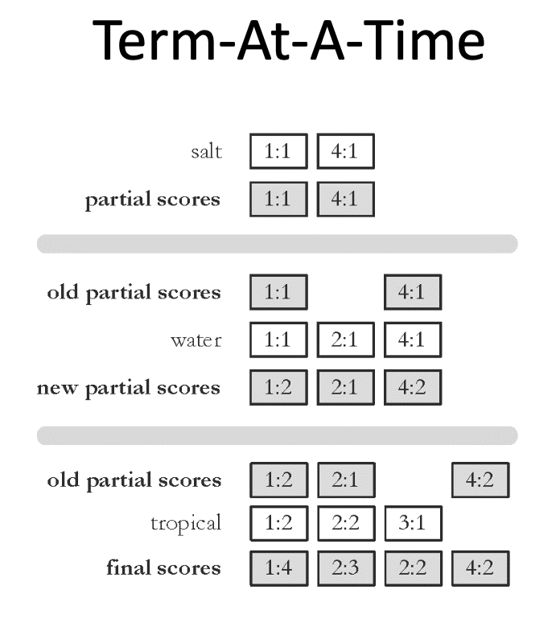</img>
    - 섞어서 쓰는게 optimization
* Optimization Techniques
    - Term-at-a-time 
        - more mem
        - fast access
    - Read less data from inverted lists
        - skip lists
        - better for simple feature functions
    - Calculate scores for fewer doc
        - conjunctive processing 
            - b/c speed, users have come to expect it
        - better for complex feature functions
    - in contrast, search engines that use longer queries, such as entire paragraphs, will not be good candidates for conjuntive processing
* Threshold Methods
    - top_ranked doc (k) to optimize query processing
        - k is small
    - minimum score that each doc needs to reach before it can be shown to user
        - score of k-th highest doc
        - gives threshold t
        - t를 설정해서 해당 안하는 문서들 다 날리는거
* MaxScore method
    - safe optimization in that ranking will be the same without optimization
    - ???????
    - 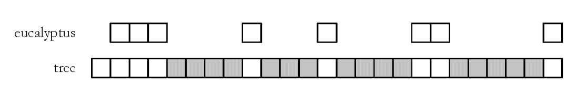</img>
    - 만약 k = 3 이라 가정하면 3 보다 큰 4 이상 score에 관해선 다 스킵 가능
* Early termination of query processing
    - ignore high-frequency word lists in **term-at-a-time**
    - ignore doc at end of lists in **doc-at-a-time**
    - unsafe optimization

    - **safe optimization vs unsafe optimization**
* List ordering
    - order inverted lists by quality metric or by partial score
    - make unsafe optimization -> produce good doc
* Structured Queries
    - similar to SQL
    - Galago query
        - #combine(#od:1(tropical fish) #od:1(aquarium fish) fish)
* Evaluation Tree for Structured Query
    - 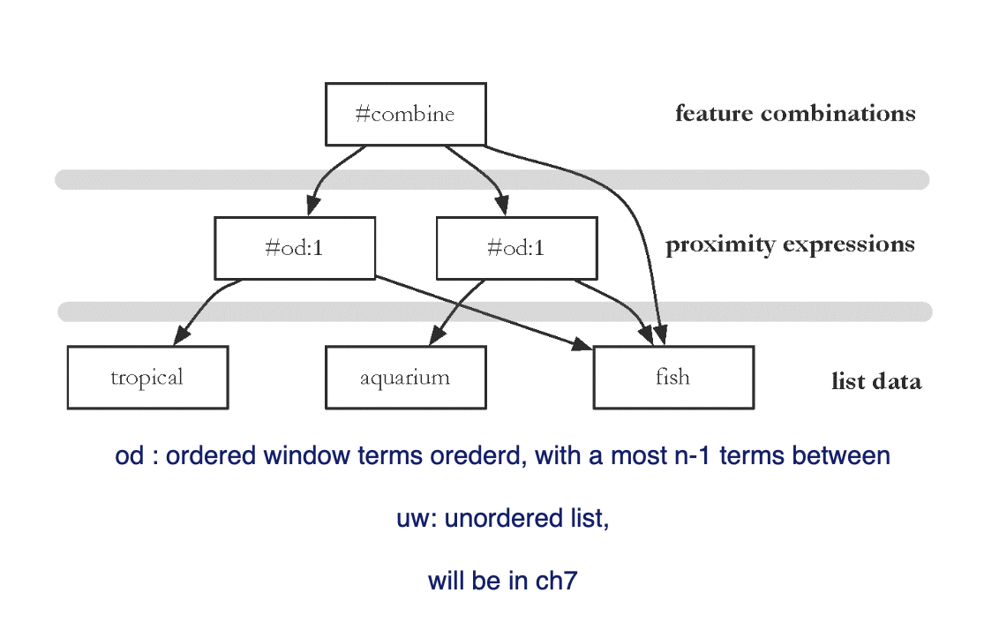</img>
* Distributed Evalutation
    - Basic process
        - All queries eent to a *director machine*
        - Director sends message to *index servers*
        - Index server has own portion of query
        - Director organizes the results
        - return to User
    - Two main approaches
        - Doc distribution
        - Term distribution
    - Document distribution
        - index server has own small fraction of the total collection
        - director sends a copy of query to each of the index servers,
        returns the top-k results
        - results are merged into a single ranked list by the director
    - Collection statistics should be shared for effctive ranking
    - Term distribution
         - Single index is built for the whole cluster of machines
         - Each inverted list for each index server
         - One of index servers is chosen to process
            - holding the longest inverted list
        - Other index servers send information to that one server
        - Final results sent to director
* Caching
    - query distribution -> refers to Zipf
    - Cache popular query results
    - Cache common inverted lists
        - help with unique queries
    - Must be rereshed to prevent stale data
    
