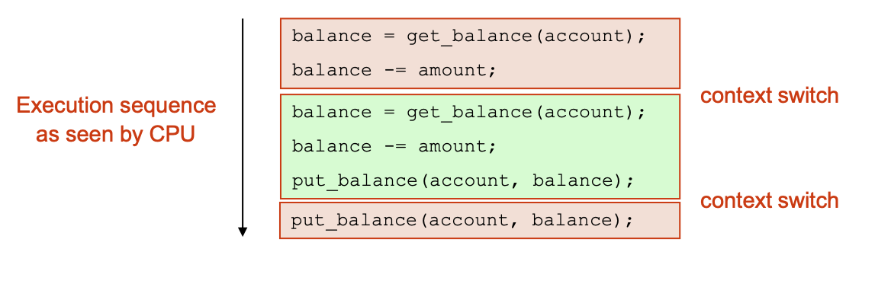
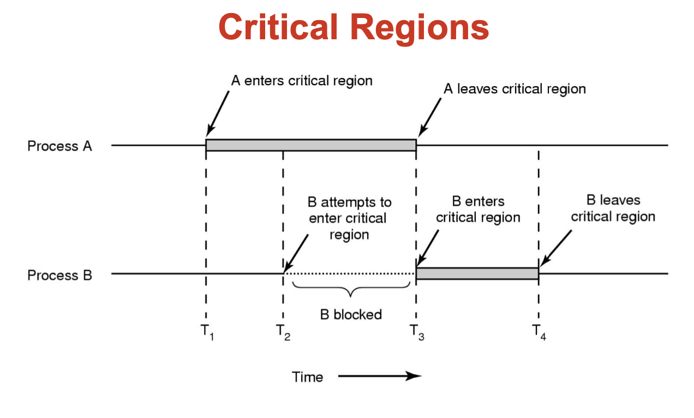
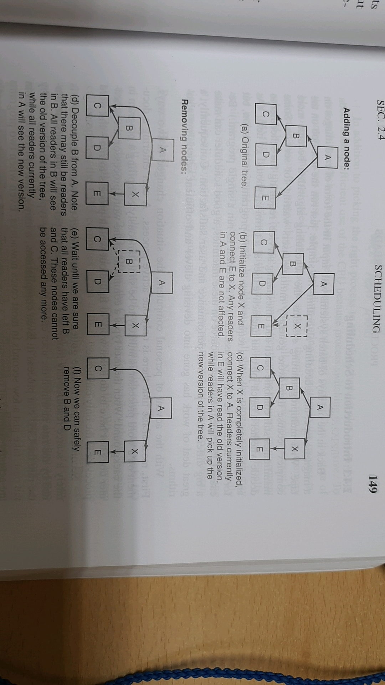
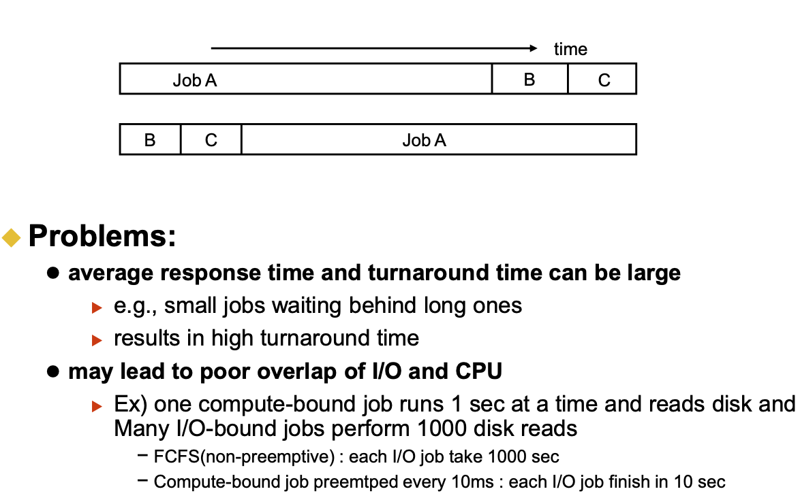
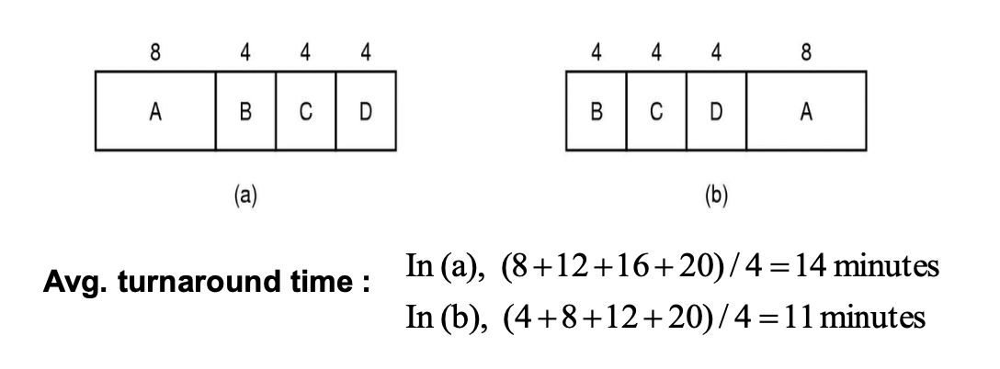

# Processes And Threads
* process 
    - address space
    - stack pointer
    - program counter
    - set of processor reg
    - set of system resources

* </img>

* PID -> idex to - PT entry
* PT entry == Process Control BLock (PCB)

* in UNIX -> process creation -> fork()
    - fork() 하면 PCB 새로 만들어짐
    - new addr space
    - copy of the enitre contents of the addr space of the parent
    - initializes kernel resource of new process with resources of parent
    - new PCB on the ready queue
* fork()
    - parent 한테 chile 한테 system call return
    - parent -> child's PID
    - child -> return 0
    - 다른 주소공간, but No 메모리공유, 자원공유 O

    - 호출 이유:
        - 호출 이후에 자식 프로세스가 execve 부르기전에 자신의 파일 드스크립터들을 조작하여 방향을 변경할 수 있기 위함
* </img>
    - ????????????????

* Fork and Exec
    - exec ()
        - stops the current process
        - loads program 'prog' into the addr space
        - initializes hardware context, args for new program
        - places PCB onto ready queue
        - **does not create a new process** 
            - ?????????
    - exec csh??
        - done nothing
    - exec ls
        - show ls but finished process
* ``` c++
    while(True){
        type_prompt(); // display prompt on the screen
        read_command(command, parameters); // read input from terminal

        if(fork() != 0){ //fork off child process
            //parent code
            waitpid(-1, &status, 0); //wait for child to exit
        } else{
            //child code
            execve(command, parameters, 0);  // execute command
        }
    }
    ```
* Process Termination
    - Normal exit (voluntary)
    - Error exit (voluntary)
    - Fatal error (involuntary)
        - program bug
        - 0으로 나누기, 
    - Killed by another process (involuntary)

* Process Termination
    - exit()
        - return from main()
        - call exit() 
            - calls all exit handlers registered by atexit()
            - close all standard I/O streams
        - call _exit()
            - called by exit() -> handles the Unix-specific details
        - abort()
            - -> SIGABRT signal
* Process Hierarchy
    - 그 노드들 연결되는거랑 비슷
* Process states
    - ready
        - could run, but not in use
    - running 
        - on CPU
        - many could run? 
            - ?????
    - blocked
        - waiting for event, ex) I/O
    - </img>
    - preemptive
        - 선점 스케쥴링
        - 선점 스케줄링(preemptive scheduling)은 시분할 시스템에서 타임 슬라이스가 소진되었거나, 인터럽트나 시스템 호출 종료 시에 더 높은 우선 순위 프로세스가 발생 되었음을 알았을 때, 현 실행 프로세스로부터 강제로 CPU를 회수하는 것을 말한다.
* Implementation of Processes
    - Process
        - address space
        - code for running program
        - data for running program
        - execution stack and stack poiner (SP)
        - PC (program counter)
        - general-purpose processor registers and their value
        - OS resources
    - PID
        - processor ID
* Process data structures
    - Process control block **PCB** (process table)
    - PCB
        - PC
        - SP
        - Registers
    - process is unscheduled, the state -> PCB (in hardware)
    - </img>
    - 1,2,3 -> PCB 저장 
    - 7, 8 -> PCB 부름
    - </img>
* Parallel Programs
    - shmget()?
    - space : PCB, page tables, etc
    - time : creating OS structures, fork and copy addr space, etc
* Thread
    - process = resource group + thread of execution
        - execution state -> thread
    - code & data(address space) 공유
    - file, socket 등 자원 공유
    - privilleges 공유
    - **Hardware execution state 만 다름** 
        - pc, sp, regis, stack
    - 장점
        - 다수의 동작이 동시에 진행, 주소공간 공유
        - 프로세스보다 경량이어서 생성, 제거가 쉽다.
        - I/O & CPU 동시에 있는 경우 성능이 더 좋다
        - 다수의 CPU tltmxpa
        - 다수의 Threads 가 하나의 process
            - 주소공간, 다른 자원 공유
        - 다수 process 가 하나의 computer
            - 물리적인 메모리, 디스크, 프린터, 기타 자원 공유
    - unit of scheduling (or context switch unit)
        - processes are just containers
    -  </img>
    - Thread 별로 stack 이 쌓임
        - **각 스레드들이 각자 자신의 스택을 가져야하는 이유???**
        - ex) 하나가 실행하다가 다른 스레드를 불러야할때 실행 완성되기 전이라 마무리 하기 전까진 모두 스택에 붙어있어야하니깐 
    - code 에 PC 가 각각 있음
* Performance
    - creating process -> b/c newely allocate data structures
    - interprocess communication 
        - overhead +++
* POSIX Threads
    - Pthread_create
        - Create new thread
    - Pthread_exit
        - Terminate the calling thread
    - Pthread_join
        - Wait for a specific thread to eixt
    - Pthread_yield
        - Release the CPU to let another thread run
    - Pthread_attr_init
        - Create and initialize a thread's attribute structure
    - Pthread_attr_destroy  
        - Remove a thread's attribute structure
* Kernel threads and user-level threads
    - creating/managing thread?
        - OS
            - system call
        - user-level process
            - library linked into the program manages the threads
    - User-level threads
        - 돌다가 다른 스레드를 기다리거나 blocked state 가 될때
            - run-time system procedure 을 불러서 멈춤
        - 장점
            - 스레드를 지원하지 않은 환경에서도 구현가능
            - 각 프로세스마다 자신에게 특화된 스케줄링 알고리즘을 가질수 있다 
                - 각 프로세스마다 자신의 thread table을 가질수 있다
            - kernel X 
                - only via procedure calls
                - no trap, no context(process) switch, no cache flush
        - 단점
            - OS 에서 해당 thread 들이 어떻게 돌아가는지 모름
            - Use nonblocking calls
            - check in advanced if the call will bock : wrapper 
                - **?????????**
            - Page fault
                - page fault 가 발생하면 disk io 가 발생하는데 이때 OS는 해당 process 의 thread 를 모르니깐 전체 process를 멈춰버림
            - A thread may run forever
                - No clock interrupt
                - scheduler 가 control back 못함
                - Use clock signal - crude and messy?
                - 예를 들면 키보드 입력을 기다리는 thread 가 있는데 입력을 기다리는 동안 다른 thread 가 cpu 사용이 불가능 하니깐 매우 불편, 그래서 입력을 0byte로 생각해서 받는다 치면 os를 건드려서 바꿔야하니 매우 불편
    - Kernel Thread
        - keeps all traces of threads
        - also maintains the traditional process table to kepp track of process
        - 장점
            - possible to overlap I/O and computation inside a process
            - no nonblocking system call
        - 단점
            - thread operations are all system calls
            - must maintain kernel state for each thread
            - context switch of kernel threads >>> expensive than user threads
    - Hybrid Implementations
        - 하나의 kernel thread 에 여러개의 user thread
        - **Kernel aware of kernel-level threads**
* Scheduler Activations
    - 호출이 안전한지 검사 ㄴ
    - 페이지 폴트여도 수행 가능
    - Pop-up thread
        - 갑자기 어떠한 메세지가 생기면 그걸 컨트롤할 thread 생기는것
    - Goal  
        - mimic functionality of kernel threads
            - gain performance of user space threads
    - Avoid unnecessary user/kernel transitions
        - user-space un-time system can block the synchronizing thread and schedule a new one ???????
    - Kernel use upcall
        - notify run-time system info on a blocked thread
        - notify the run-time system when the blocked thread is ready again
    - Problems
        - Fundamental reliance on kernel (lower layer)
        - calling procedures in user space (higher layer)
* Synchronization (Interprocess Communication)
    - 1. How one process pass info to another?
        - 
    - 2. How multiple processes get same resource at one time?
        - 
    - 3. How A produces data and B print?
        - 
    - this also applies to processes, not just threads
* Race condition
    - A 가 Spooler directory 에다가 자신이 다음 일 할거를 적어놨는데 그 순간 cpu interrupt 발생, B가 다음 할일을 받아와야하는데 그 다음 할일 전역 변수에 A가 저장한 값이 들어가서 이상한게 됨
    - 즉, 누가 먼저 수행되느냐에 따라 다른 수행 상황
* Critical Regions (Section)
    - 임계구역 
        - Requirements
            1. No two processes may be simultaneously inside their critical regions
            2. No assumptions may be made about CPU speed of numbers
            3. No process running outside its critical region may block any process
            4. No process should have to wait forever to enter its critical region.
    - mutual exclusion (mutex)
        - 한 프로세스가 전역변수를, shared variables 를 사용하면 다른 프로세스가 사용하지 못하게 하는거
    - </img>
    - </img>
    
* Mutual Exclusion with Busy Waiting
    - Disabling Interrupt
        - 효율 ㅆㅎㅌㅊ
        - 멀티코어에 효과 ㄴ
    - Lock Varialbes
        - 락변수 (소프트웨어 솔루션)
            - 0 -> ok, 1 -> wait
        - 글로벌 변수라서 Spooler directory 와 같은 문제점
    - Strict Alternation
        - busy waiting
            - 계속 변수를 확인해야하니
                - wastes CPU time
        - spin lock
            - lock 변수로 어떤 process 가 critical region에 들어올지 정의
            - 그러면서 busy waiting 으로 돌아감
    - Peterson's Solution
        - 순서랑 다음에 누구 할지 정하는 변수 주고
        - 떠날때는 누구할지 정하는 관심 변수에다가 0으로 false로 초기화
    - TSL (Test and Set Lock) instruction
        - Test-and-Set, Swap, compare-and-swap , **ATOMIC** instructions
        - 공유방법 : Indivisible operation
            - Lock : Shared variable
        - 인터럽트를 끄더라도 다른 처리기가 접근하는걸 막을 수 없다.
        - 하지만 메모리 버스를 잠구면 접근 불가
    - Spin-lock 문제점
        - CPU waste
        - 우선순위 역전
        - 밑에 Sleep and Wakeup 해결책
    - Sleep and Wakeup
        - sleep() -> system call
        - wakeup() -> wake a blocked process up
    - Producer=consumer problem (bounded-buffer)
        - producer -> Puts info into buffer
        - consumer -> Takes info out of buffer
        ``` c++
        while(1){
            item = produce_item();
            if(count == N) sleep(); // 이떄 인터럽트 걸림, if 조건 맞는지 보고 바로 sleep 전
        }
        ```
        - 1. global 인수 보호필요
        - 2. buffer도 보호 필요
        - 3. 둘다 sleep 이 될 수 있다 (Critical 섹션으로 보호해야함)
* Semaphores
    - synchronization primitive
        - 특정 이벤트 순서들이 발생하거나 발생하지 않도록 보장하기 위해
    - non-negative integers
    - down: block until semaphore <= 0
        - P()
    - up: allow another to enter
        - V()
    - Binary semaphore (aka mutex semaphore)
        - counter is initialized to 1 (semaphore value changes between 0 - 1)
    - Counting semaphore (aka counting semaphore)
        - counter is initialized to N
            - N = number of unitsavailable
    - 단점:
        - no control over thier use, no guarantee of proper usage
            - Ex) donw(mutex) followed by down(empty)
        - prone to bugs
            - Monitor -> 해결책
* Mutexes
    - simplified version of the semaphore
        - Unlocked : 0
        - Locked : non-zero
    - Usage
        - mutex_lock
        - critical_region
        - mutex_unlock
    - **Compare it with the previous example on TSL**
* Futexes
    - Kernel service & user library
        - Locking, atomic "decrement and test"
        - if succeeds, no kernel action is involved
        - if fails, system call to put thread on wait queue in kernel
        - Unlocking, atomic "increment and test"
    - other thread 가 block -> kernel 보고 queue에 있는거 풀어달라 요청
    - shared data strucures, semaphores, can be stored in the kernel and only accessed via system calls
    - If nothing else is possible, a shared file can be used.
* Monitors
    - programming language
    - supports controlled access to shared data
    - encapsulates module
        - shared data 
        - procedures
        - synchronization
    - protects data from unstructured access
    - mutual exclusion
        - only one process can be executing inside at any time
    - Condition Variables
        - only be accessed from inside monitor
    - can't progress? -> wait place
    - wait(c)
        - release monitor lock, others can get in
        - wait for others to signal condition
        - thus, condition variables have wiat queues
    - signal(c)
        - wake up the oldest
        - no signal?
            - **which one will continue first after signal? Signaler or Waiter??????????**
    - Producer/Consumer with Monitors
        - only one monitor procedure active at one time
        - Similar to sleep/wakeup(), but no race conditions! **why???**
    
    - Hoare monitors: signal(c) maens?
        - waiter runs immediately and signalers blocks 
    - Hansen monitors: signal(c) maens?
        - Siglnalers must exit the monitor immediately and waiter runs
        - Conceptually simpler and easier to implement
    - Mesa monitors: signal(c) maens?
        - waiter is made ready, but the signaler continues
        - condition is not necessaruily ture when waiter runs again
    - 단점:
        - 세마포어보다 제약
            - but 단순 & 문제해결 가능
        - 프로그램 언어 개념
            - c언어에서 불가
        - 분산환경에서 사용 X (multiple CPUs)
* Message Passing
    - Interprocess communication
        - via system call
        - send(destination, &message)
        - receive(source, &message)
            - if no message is available, receiver can block until one arrives
* Barriers
    - 여러가지 thread, process가 다 수행되면서 다른 애들 다 끝날떄까지 기다림
    - 다 오면 베리어 넘김
    
    - Dining Philosophers Problem
        - Dead Lock 발생
* Avoiding Locks: Read-Copy-Update
    - We can allow multiple readers at time
        - why?
    - We can only allow one writer at a time
        - why?
    - </img>
* Scheduling
    - scheduling is policy
    - context switching is mechanism
    - 스케줄링(scheduling)은 다중 프로그래밍을 가능하게 하는 운영 체제의 동작 기법이다. 운영 체제는 프로세스들에게 CPU 등의 자원 배정을 적절히 함으로써 시스템의 성능을 개선할 수 있다.

    - context switch의 부담을 줄이기 위한 스케쥴링
        - user -> kernel
        - save state
        - save mem map
        - select next process
        - reload MMU
    - When to Schedule
        - 1. new process is created
        - 2. process exits
        - 3. process blocks on I/O, semaphore, etc
        - 4. I/O interrupt
        - 5. clock interrupts (prevent deadlock)

    - Nonpreemtive
        - 선점이 아니다.
        - 즉, block 걸릴떄까지 계속 process 가 동작
    - Preemtive
        - 선점
        - 즉, fixed time 동안 process 동작
    - OS 컨트롤 넘기는 방법
        1. system call
        2. interrupt
    - Batch
        - Nonpreemtive, or long time period of preemptive
        - Reduces process switches and imporeves performance
        - Throughput
        - CPU utilization
    - Interactive
        - Preemtive -> prevent CPU hoggin & denying service to others
        - Response time 
        - Proportionality
    - Real time
        - daed line 을 알기에 필요없을 수 있음 preemtive
* Multiprogramming and scheduling
    - long term
        - determining the multiprogramming level
            - how many jobs are loaded into primary memory
    - short term
        - which job to run next to result in "good service"
    - GOAL
        - Prevent starvation
* FCFS/FIFO
    - first come first served
        - non-preemptive
        - no context switch
        - no starvation
            - except for infinitely long jobs
    - Problem
        - </img>
        - 만약 a = 8, b = 2, c = 2; 일때 
            - 1번 그림에서는 a는 8초, b는 10초, c는 12초에 끝나고 
            - 2번 그림에서는 b는 2초, c는 4초, a는 12초가 걸린다,
            - 즉, 1번은 평균 22초/3     2번은 18초/3 가 달라짐, 
            - 즉, average response tim and turnaround time can be large
            - may lead to poor overlap of I/O and CPU
    - 그래서 sjf 등장
* Shotest Job First (SJF)
    - 근데 또 웃긴게 이것도 단점
    - NO Idea future CPU burst
    - </img>
        - 보면 이렇게 잘 되는거 같지만
    - Job A,B,C,D,E with run times of 2,4,1,1,1 and arrival times of 0,0, 3,3,3 : SJF results in the order A,B,C,D,E, but the order B,C,D,E,A has the best result.
    - </img>
        - 이런식으로 오히려 짧은걸 앞으로 주면 더 느려질때도 있음
* SRTN (Shtorest Remaining Time Next)
    - preemptive version of shertest job first
    - runtime has to be know is advance
    - new short jobs can get good service
* Round Robin
    - ready queue is treated as a circular FIFO queue
    - each job is given a time slice, called a **quantum**
    - job executes for duration of quantum, or until it blocks
    - Time slicing??
        - No starvation
    
    - Problems
        - No setting for quantum
            - if small? : context switch too often, high overhead
            - if large? : response time drop
            - usually 20~50ms
* Priority Scheduling **important**
    - Assign job with highest priority
        - if tie, use another algorithm (e.g. FCFS)
    - Priority Assignment
        - Static
            - Based on user, or price ,, etc
        - Dynamic
            - Give good service to I/O-bound processes
            - Decrease running procesess's priority each clock
            