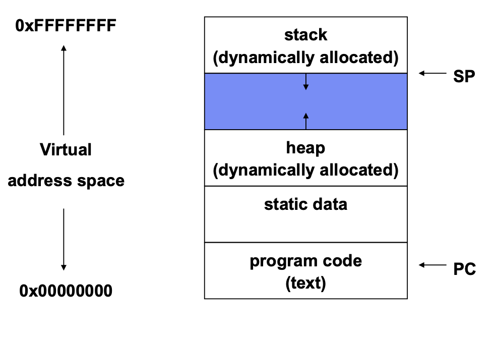
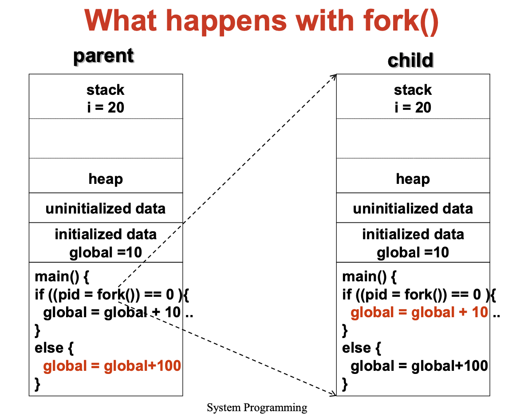
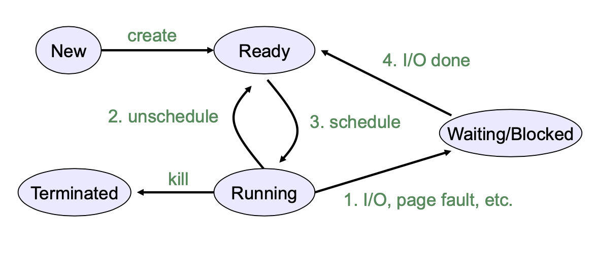
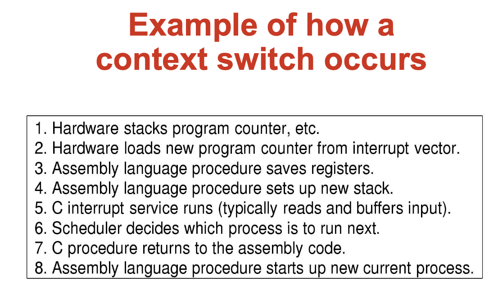

# Processes And Threads
* process 
    - address space
    - stack pointer
    - program counter
    - set of processor reg
    - set of system resources

* </img>

* PID -> idex to - PT entry
* PT entry == Process Control BLock (PCB)

* in UNIX -> process creation -> fork()
    - fork() 하면 PCB 새로 만들어짐
    - new addr space
    - copy of the enitre contents of the addr space of the parent
    - initializes kernel resource of new process with resources of parent
    - new PCB on the ready queue
* fork()
    - parent 한테 chile 한테 system call return
    - parent -> child's PID
    - child -> return 0
    - 다른 주소공간, but No 메모리공유, 자원공유 O

    - 호출 이유:
        - 호출 이후에 자식 프로세스가 execve 부르기전에 자신의 파일 드스크립터들을 조작하여 방향을 변경할 수 있기 위함
* </img>
    - ????????????????

* Fork and Exec
    - exec ()
        - stops the current process
        - loads program 'prog' into the addr space
        - initializes hardware context, args for new program
        - places PCB onto ready queue
        - **does not create a new process** 
            - ?????????
    - exec csh??
        - done nothing
    - exec ls
        - show ls but finished process
* ``` c++
    while(True){
        type_prompt(); // display prompt on the screen
        read_command(command, parameters); // read input from terminal

        if(fork() != 0){ //fork off child process
            //parent code
            waitpid(-1, &status, 0); //wait for child to exit
        } else{
            //child code
            execve(command, parameters, 0);  // execute command
        }
    }
    ```
* Process Termination
    - Normal exit (voluntary)
    - Error exit (voluntary)
    - Fatal error (involuntary)
        - program bug
        - 0으로 나누기, 
    - Killed by another process (involuntary)

* Process Termination
    - exit()
        - return from main()
        - call exit() 
            - calls all exit handlers registered by atexit()
            - close all standard I/O streams
        - call _exit()
            - called by exit() -> handles the Unix-specific details
        - abort()
            - -> SIGABRT signal
* Process Hierarchy
    - 그 노드들 연결되는거랑 비슷
* Process states
    - ready
        - could run, but not in use
    - running 
        - on CPU
        - many could run? 
            - ?????
    - blocked
        - waiting for event, ex) I/O
    - </img>
    - preemptive
        - 선점 스케쥴링
        - 선점 스케줄링(preemptive scheduling)은 시분할 시스템에서 타임 슬라이스가 소진되었거나, 인터럽트나 시스템 호출 종료 시에 더 높은 우선 순위 프로세스가 발생 되었음을 알았을 때, 현 실행 프로세스로부터 강제로 CPU를 회수하는 것을 말한다.
* Implementation of Processes
    - Process
        - address space
        - code for running program
        - data for running program
        - execution stack and stack poiner (SP)
        - PC (program counter)
        - general-purpose processor registers and their value
        - OS resources
    - PID
        - processor ID
* Process data structures
    - Process control block **PCB** (process table)
    - PCB
        - PC
        - SP
        - Registers
    - process is unscheduled, the state -> PCB (in hardware)
    - </img>
    - 1,2,3 -> PCB 저장 
    - 7, 8 -> PCB 부름
    - </img>
* Parallel Programs
    - shmget()?
    - space : PCB, page tables, etc
    - time : creating OS structures, fork and copy addr space, etc
* Thread
    - process = resource group + thread of execution
        - execution state -> thread
    - code & data(address space) 공유
    - file, socket 등 자원 공유
    - privilleges 공유
    - **Hardware execution state 만 다름** 
        - pc, sp, regis, stack
    - 장점
        - 다수의 동작이 동시에 진행, 주소공간 공유
        - 프로세스보다 경량이어서 생성, 제거가 쉽다.
        - I/O & CPU 동시에 있는 경우 성능이 더 좋다
        - 다수의 CPU tltmxpa
        - 다수의 Threads 가 하나의 process
            - 주소공간, 다른 자원 공유
        - 다수 process 가 하나의 computer
            - 물리적인 메모리, 디스크, 프린터, 기타 자원 공유
    - unit of scheduling (or context switch unit)
        - processes are just containers
    -  </img>
    - Thread 별로 stack 이 쌓임
        - **각 스레드들이 각자 자신의 스택을 가져야하는 이유???**
        - ex) 하나가 실행하다가 다른 스레드를 불러야할때 실행 완성되기 전이라 마무리 하기 전까진 모두 스택에 붙어있어야하니깐 
    - code 에 PC 가 각각 있음
* Performance
    - creating process -> b/c newely allocate data structures
    - interprocess communication 
        - overhead +++
* POSIX Threads
    - Pthread_create
        - Create new thread
    - Pthread_exit
        - Terminate the calling thread
    - Pthread_join
        - Wait for a specific thread to eixt
    - Pthread_yield
        - Release the CPU to let another thread run
    - Pthread_attr_init
        - Create and initialize a thread's attribute structure
    - Pthread_attr_destroy  
        - Remove a thread's attribute structure
* Kernel threads and user-level threads
    - creating/managing thread?
        - OS
            - system call
        - user-level process
            - library linked into the program manages the threads
    - User-level threads
        - 돌다가 다른 스레드를 기다리거나 blocked state 가 될때
            - run-time system procedure 을 불러서 멈춤
        - 장점
            - 스레드를 지원하지 않은 환경에서도 구현가능
            - 각 프로세스마다 자신에게 특화된 스케줄링 알고리즘을 가질수 있다 
                - 각 프로세스마다 자신의 thread table을 가질수 있다
            - kernel X 
                - only via procedure calls
                - no trap, no context(process) switch, no cache flush
        - 단점
            - OS 에서 해당 thread 들이 어떻게 돌아가는지 모름
            - Use nonblocking calls
            - check in advanced if the call will bock : wrapper 
                - **?????????**
            - Page fault
                - page fault 가 발생하면 disk io 가 발생하는데 이때 OS는 해당 process 의 thread 를 모르니깐 전체 process를 멈춰버림
            - A thread may run forever
                - No clock interrupt
                - scheduler 가 control back 못함
                - Use clock signal - crude and messy?
                - 예를 들면 키보드 입력을 기다리는 thread 가 있는데 입력을 기다리는 동안 다른 thread 가 cpu 사용이 불가능 하니깐 매우 불편, 그래서 입력을 0byte로 생각해서 받는다 치면 os를 건드려서 바꿔야하니 매우 불편
    - Kernel Thread
        - keeps all traces of threads
        - also maintains the traditional process table to kepp track of process
        - 장점
            - possible to overlap I/O and computation inside a process
            - no nonblocking system call
        - 단점
            - thread operations are all system calls
            - must maintain kernel state for each thread
            - context switch of kernel threads >>> expensive than user threads
    - Hybrid Implementations
        - 하나의 kernel thread 에 여러개의 user thread
        - **Kernel aware of kernel-level threads**
* Scheduler Activations
    - 호출이 안전한지 검사 ㄴ
    - 페이지 폴트여도 수행 가능
    - Goal  
        - mimic functionality of kernel threads
            - gain performance of user space threads
    - Avoid unnecessary user/kernel transitions
        - user-space un-time system can block the synchronizing thread and schedule a new one ???????
    - Kernel use upcall
        - notify run-time system info on a blocked thread
        - notify the run-time system when the blocked thread is ready again
    - Problems
        - Fundamental reliance on kernel (lower layer)
        - calling procedures in user space (higher layer)
* Synchronization (Interprocess Communication)
    - 