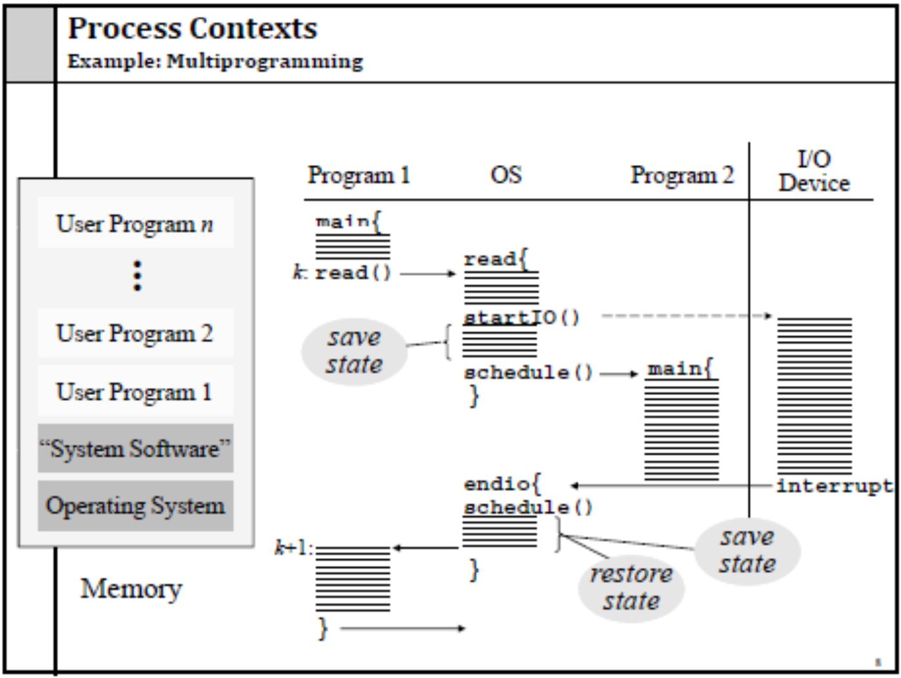

# Processes And Threads
* process 
    - address space
    - stack pointer
    - program counter
    - set of processor reg
    - set of system resources

* </img>

* PID -> idex to - PT entry
* PT entry == Process Control BLock (PCB)

* in UNIX -> process creation -> fork()
    - fork() 하면 PCB 새로 만들어짐
    - new addr space
    - copy of the enitre contents of the addr space of the parent
    - initializes kernel resource of new process with resources of parent
    - new PCB on the ready queue
* fork()
    - parent 한테 chile 한테 system call return
    - parent -> child's PID
    - child -> return 0
    - 다른 주소공간, but No 메모리공유, 자원공유 O

    - 호출 이유:
        - 호출 이후에 자식 프로세스가 execve 부르기전에 자신의 파일 드스크립터들을 조작하여 방향을 변경할 수 있기 위함
* </img>
    - ????????????????

* Fork and Exec
    - exec ()
        - stops the current process
        - loads program 'prog' into the addr space
        - initializes hardware context, args for new program
        - places PCB onto ready queue
        - **does not create a new process** 
            - ?????????
    - exec csh??
        - done nothing
    - exec ls
        - show ls but finished process
* ``` c++
    while(True){
        type_prompt(); // display prompt on the screen
        read_command(command, parameters); // read input from terminal

        if(fork() != 0){ //fork off child process
            //parent code
            waitpid(-1, &status, 0); //wait for child to exit
        } else{
            //child code
            execve(command, parameters, 0);  // execute command
        }
    }
    ```
* Process Termination
    - Normal exit (voluntary)
    - Error exit (voluntary)
    - Fatal error (involuntary)
        - program bug
        - 0으로 나누기, 
    - Killed by another process (involuntary)

* Process Termination
    - exit()
        - return from main()
        - call exit() 
            - calls all exit handlers registered by atexit()
            - close all standard I/O streams
        - call _exit()
            - called by exit() -> handles the Unix-specific details
        - abort()
            - -> SIGABRT signal
* Process Hierarchy
    - 그 노드들 연결되는거랑 비슷
* Process states
    - ready
        - could run, but not in use
    - running 
        - on CPU
        - many could run? 
            - ?????
    - blocked
        - waiting for event, ex) I/O
    - </img>
    - preemptive
        - 선점 스케쥴링
        - 선점 스케줄링(preemptive scheduling)은 시분할 시스템에서 타임 슬라이스가 소진되었거나, 인터럽트나 시스템 호출 종료 시에 더 높은 우선 순위 프로세스가 발생 되었음을 알았을 때, 현 실행 프로세스로부터 강제로 CPU를 회수하는 것을 말한다.
* Implementation of Processes
    - Process
        - address space
        - code for running program
        - data for running program
        - execution stack and stack poiner (SP)
        - PC (program counter)
        - general-purpose processor registers and their value
        - OS resources
    - PID
        - processor ID
* Process data structures
    - Process control block **PCB** (process table)
    - PCB
        - PC
        - SP
        - Registers
    - process is unscheduled, the state -> PCB (in hardware)
    - </img>
    - 1,2,3 -> PCB 저장 
    - 7, 8 -> PCB 부름
    - </img>
* Parallel Programs
    - shmget()?
    - space : PCB, page tables, etc
    - time : creating OS structures, fork and copy addr space, etc
* Thread
    - process = resource group + thread of execution
        - execution state -> thread
    - code & data(address space) 공유
    - file, socket 등 자원 공유
    - privilleges 공유
    - **Hardware execution state 만 다름** 
        - pc, sp, regis, stack
    - 장점
        - 다수의 동작이 동시에 진행, 주소공간 공유
        - 프로세스보다 경량이어서 생성, 제거가 쉽다.
        - I/O & CPU 동시에 있는 경우 성능이 더 좋다
        - 다수의 CPU tltmxpa
        - 다수의 Threads 가 하나의 process
            - 주소공간, 다른 자원 공유
        - 다수 process 가 하나의 computer
            - 물리적인 메모리, 디스크, 프린터, 기타 자원 공유
    