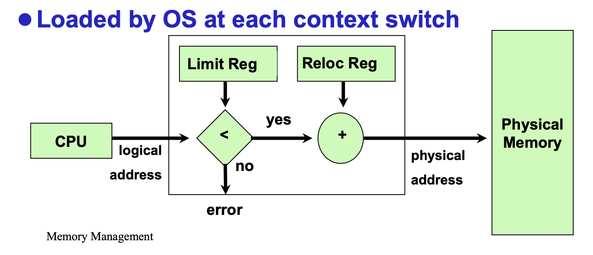

# Memory Management
* Memory Hierarchy
    - </img>
* No Memory Abstraction
    - Multiple Programs Without Memory Abstraction
        - </img>
        - a process 가 0번으로 들어가면 b process 가 a process 맨 뒤에 16380 다음 부분으로 들어갈텐데 b 프로세스에서 명령어가 JMP 28 명령어가 실행되면 실제 28번으로 (다른 process로 넘어간다) 그래서 JMP 16412로 새로 relocation 해야한다.
        - 남 명령어가 쳐들어오지 않게끔
        - function call
    - 왜 physical memory를 노출하면 안되나?
        - No protection
            - Os나 다른 process의 address를 함부로 날릴수있기에
        - Relocation is needed
            - Difficult to have multiple programs running at once
    - Address Space 
        - process 가 쓸 수 있는 메모리 영역
    - Physical address space
        - 하드웨어에서 Address Space    
    - Logical/virtual address space
        - 
* Virtual Addresses
    - Independent of location
    - In Physical memory (RAM)
    - OS 가 관리
    - CPU가 계산 (instruction issued by CPU)
    - Virtual addr -> Physical addr, by hardware, with little help of OS
* Base and Limit Registers
    - 위에 2가지 프로세스의 메모리 들어갈때 시작 주소 위치 변경 용이하게 하는 hardware
    - </img>
    - os 만 수정 가능
    - 단점 : 메모리 참조마다 덧셈과 비교연산 요구된다.
    - 메모리에 process 다 올라와야 사용 가능, external fragment
    - solution : relocation compaction -> too much overhead
* 메모리 왔다 갔다
    - paging system
        - 다 메모리에 올리거나 다 hdd에 넣거나
    - Stack & 동적할당(Heap)
        - process 크기가 커짐 -> mem에서 뺏다가 다시 넣고  or  mem 내에서 재배치
* Swapping
    - Not enough mem to hold all active process
    - Two approaches
        - Swapping
            - 아예 프로세스 하나를 다 들고오고, 디스크에 몽땅 다시 넣고
        - Virtual Memory
            - 프로세스 일부분만 들고와서 메인 메모리에 넣고 씀
    - Memory Compaction
        - Swapping 시 유휴 mem addr space 를 한데로 모으는거
        - 시간이 많이 걸림
        - solution : relocation compaction -> too much overhead
    - Room for growth
        - </img>
        - **이거 다시 제대로 봐야함**
        1. 공간을 더 쓸것 같은 process 면 애초에 더 할당
            - 위로 더 늘어나고
        2. process 가 증가될 수 있는 두 개의 세그먼트를 갖는다면 (메모리의 동적 할당과 해제, 힙, 지역변수 및 복귀주소가 저장되는 스택 세그먼트 두개의 세그먼트를 갖는다면) 
            - 위아래 잡아놓고 내려오는거 위에가 스택
* Memory Management with Bit Maps
    - 8 자리의 bit map 으로 설정
        - 해당하는 부분이 차있으면 1 아니면 0
        - 즉, bit map의 한칸은 allocation unit의 크기, 
        - 1 bit 라고 해서 allocation unit이 1bit은 아님.
        - 만약 allocation unit 을 4 byte 로 조진다면 8bit 를 1bit으로 bit map mapping 한건데,
        - 그러면 전체 메모리의 **1/33** 이 bit map 으로 됨
    - 리스트는 P -> Process, H -> Hole, 
    - 앞에는 시작, 뒤에는 몇칸 차있는지
    - </img>
* Memory Management with Linked Lists
    - No allocation unit necessary
        - 왜냐면 링크드 리스트로 해당하는 프로세스가 어디까지 할당 됐는지 직접 크기를 표현할 수 있으므로
        굳이 allocation unit 단위가 필요 없음
            - No internal fragments
        - cf, bit map 에서는 필요한 이유가 한 bit 당 얼로케이션 유닛이 들어가니깐,
            - internal fragments 가 발생
    - Internel Fragmentation
        - allocation 단위 안에서 생기는 빈 공간
    - Externel Fragmentation    
        - 메모리 안에서 프로세스 가 차면서 생기는 다른 프로세스가 들어오기 좁은 fragment
* Allocating Memory for a newly created process
    - First fit
        - 앞에서부터 맞는 크기 hole 찾아 가는거
    - Next fit
        - 앞서 찾은 빈공가에서부터 다시 찾아가는거
    - Best fit
        - 딱 맞는걸 찾자
    - Worst fit 
        - 가장 큰 빈공간 할당
        - hole을 다 찾아야함
        - 점점 external fragment 증가
    - Quick fit
        - linked list에서 H 부분의 크기가 같은 애들끼리 linked list 로 또 묶어 놓음
* Virtual Memory
    - If Programs too big to fit in the available memory
    - **overlay**
        - split programs into little pieces
    - virtual memory
        - 사실상 dram에 올라가 있는게 아니라 process 에 필요한 명령어 주소들이 순서대로 들어있는 거고 그거를 가상으로 생각해서 각각이 필요할때마다 DRAM에 올려서 쓰는것, 즉, 진짜로 DRAM에 올라간거는 virtual page talbe 에서 mapping 돼서 올라간 애들뿐
* Paging
    - </img>
    - mmu is in the cpu
    - but, cache 에서 접근할때는 physical 사용
    - physical memory, corresponding units, called *page frame*
* Real Paging
    - virtual page && physical page 둘다 frame 사이즈 같아야함
    - if, Page Fault?
        - OS, Trap
        - page replace algorithm 
     - MMU 에서 translating
        - </img>
        - 앞에 4자리를 page table index 로 쓰고 그 해당 page에서 frame 넘버를 가져와서 뒤에 offset 12 자리 붙혀서 씀, 총 16자리, 
        - in this case, MMU with 16, 4KB pages
    - </img>
        - 일단 mmu with 16, 4KB 이다, 16개라는건 16비트의 길이로 판단하는거고
        - 4KB니깐 2^12Byte 이고, 즉, 16개의 4KB의 페이지들이라는거고, 이때 중요한건 각 페이지 크기가 4KB니깐 12개의 비트로 차있는지 아닌지를 파악 가능. 그래서 offset이 12개인거고
        - 12개의 오프셋 비트와 프레임 번호, 즉 16개니깐 2^4 즉, 4개의 앞에 인덱신 페이지 번호들을 지정하는 비트만 있으면 되니깐 16비트로 표현이 가능한거지.
    - </img>
        - vpn - virtual page number
        - pfn - page frame number
    - Page Table
        - managed by OS
        - PTE -> page talbe entry 인데 이게 그 page table 에서 한칸 한칸임
        - disk img == mem img ( consistent )d
    - </img>
    - **PTE**
        - </img>
        - **Modified bit**
            - 해당 페이지가 modified 되면 disk에 써줘야하는걸 알려주는거
            - dirty bit, 하는 이유가 디스크랑 항상 consist 해야하는데 그래서 consist 해야하는걸 어디가 바뀌었는지 알려주는 bit
            - 1이면 page 교체시 disk에 기록해야함
            - **????????????????? page disk 기록 이거 이해 안됨**
        - present/absent bit 
            - pfn이 유효한지 검사
        - caching disabled bit
            - 이거는 사실 h/w I/O 에 따른 것
            - I/O 에 따른 h/w 에 저장된 데이터를 예전에 캐싱된거를 참조할지 지금 새로 update 된 데이터를 받아올지
    - Page Tables
        1. Single Page table with fast h/w regis
            - no mem references during mapping
            - Loading the full page table at every context switch is *expensive*
            - 위에 나온 저 비트들 있는 줄 들
        2. Page table in main mem
            - Single regis *points* start of the page table
            - Fast mem map chage by reloading one register
            - Requires mem refernces during the execution of each instruction
            - 이게 소프트웨어로 구동하는 페이지 테이블
    - Paging Advatages
        - Easy to allocate/free physical mem
        - No external fragmentation (왜냐믄,, 각 allocation 유닛이 동일하게 짤리고 각 칸마다 명령어 한줄씩 들어가있으니깐 )
        - VAS > PAS (virtual address space, physical address space)
        - 전체 모두 없어도 됨, 필요한 것들만 들고 오면 됨
    - Paging Disadvantages
        - Still internal fragmentation
            - offset size 가 있는 이유
        - 2번 mem refrence
            - 일단 page table 에 한번 왔다가 진짜 주소 얻어서 다시 mem 에 가서 그 명령어 해야하니깐
            - overhead 발생
            - 이걸 해결하려고 TLB 라는 h/w 사용
                - cache to absorb page table lookups
        - 만약 32 bit 시스템이면
            - 4KB 크기의 페이지를 사용한다면 2^32 40억, 페이지 크기 나눠주면 100만개의 페이지 엔트리 필요
            - **이거 이해 안되네**
    - TLB
        - Translation blookaside buffers
            - virtual page number -> PTE (**not physical addr**)
        - It's in H/W
            - fully associative cache (한번에 몽땅 TLB를 돌면서 찾을 수 있음)
        - Locality
            - 이거 때문에 잘 돌아가는것
        - valid bit
        - virtual page
        - modified bit
        - Protection
        - Page frame
        - copied from the page table entry
        - **Modified bit is copied back into the PTE when purged**
    - MMU with TLB
        - mem 에 있는 Table 대신에 MMU의 TLB에 먼저 접근
            - In the case, every machine with paged virtual mem has page tables recognized by the h/w & TLB, TLB mange & faults are handled by MMU h/w
                TRAPs to the os occur only when a page is not in mem
            -  RISC, and modern system, all these things done by software
        - *What happen when TLB hits of occur?*
            - When miss happens?
                - TLB generate fault & tosses the problem into the lap of the os.
                - System fine the page, remove an entry from the TLB, enter the new one, and restart the instruction fault
                - TLB miss 가 page faults 보다 빈번
            1. TLB 미스 나면 page table 가서 찾는건데
                - TLB cache 크기 키우면 miss rate 낮출 수 있음
            2. TLB by software
                - soft miss
                    - page referenced ㄴㄴ, but in mem?
                        - fast update 2ns
                - hard miss
                    - page itself is not in mem
                    - disk I/O, 2ms
                - page table walk?
                    - 
        - TLB Flush?
            - each process typically has its own page tables
            - **when process context switch!!**
* Two-Level page table
    - </img>
    - 우선 페이지 크기? 4KB -> 2의 몇승인지? 12승이면 offset의 사이즈가 12비트
    - 4 bytes/PTE -> PTE면 페이지 테이블 엔트리, 즉 페이지 테이블의 한칸 한칸, 따라서 4KB / 4 bytes -> 1024개의 PTE 존재
    - 1024개의 PTE면 무엇이냐? second level page table 갯수가 그만큼 있다는거지
    - 위에 PTE 갯수 구한게 1024개니깐 즉, 일자로된 비트 로 나타날때 first level bit의 갯수가 2^10 즉, 10개짜리다,
    - 그래서 총 32개의 비트 체계라면 first level bit = 10, offset =12 개니깐 자동으로 32 - 10 - 12 니깐 10bit 가 second level bit 가 된다

* Inverted Page Table
    - 만약 page table로 64bit 주소 체계면??
        - 수십억 페이지 테이블이 나와야하는데 망함
        - solution for larger page table
    - One entry per page frame in real memory
    