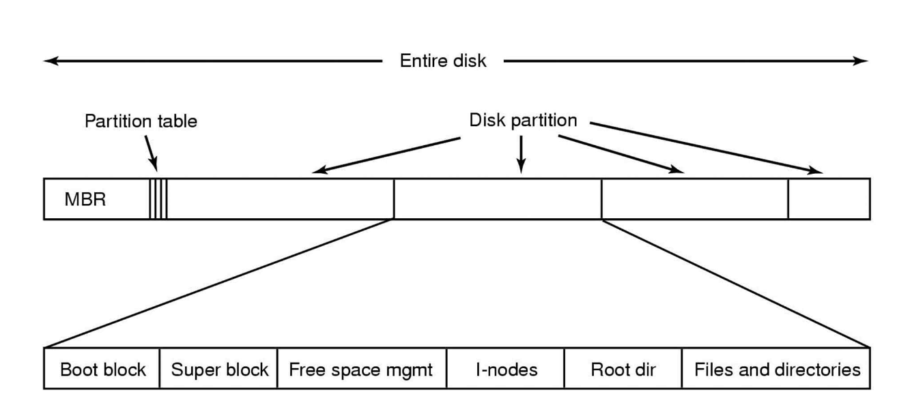
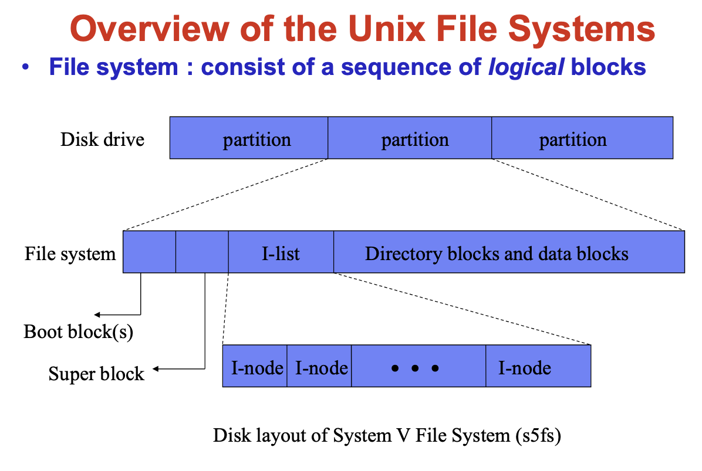
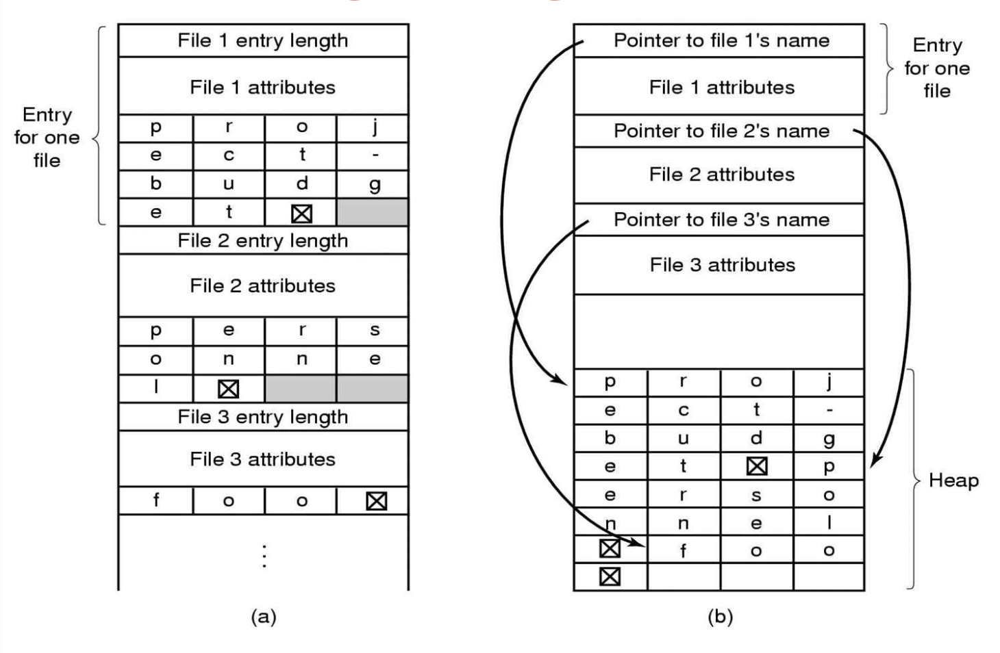
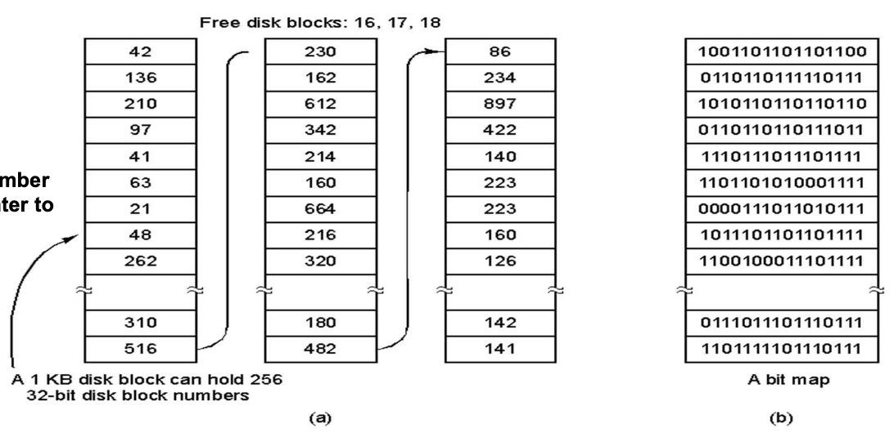
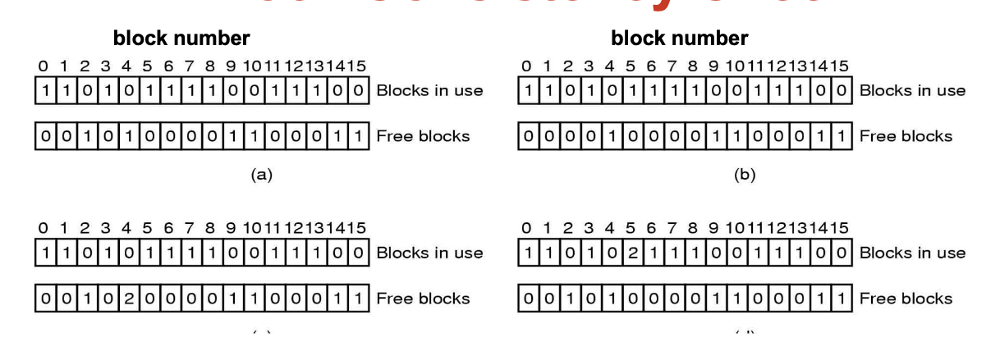
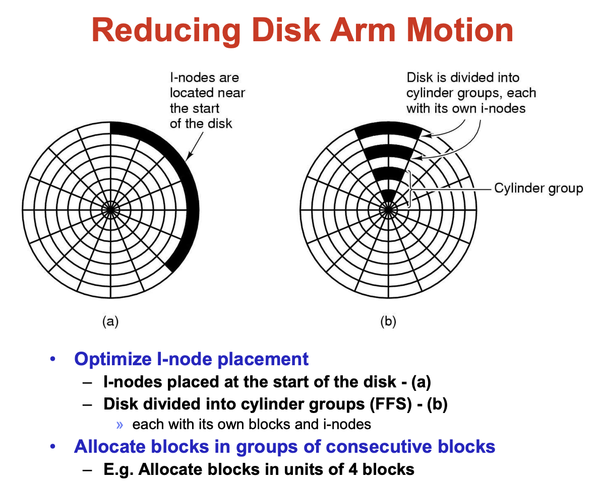

# File System
* Long-term Information Storage
    - Must store large
    - info survive the termination of thre process using it
        - persistent
    - multiple processes must be albe to access the info

    - Solution
        - store in units called file
        - info in files must be persistent
        - File System : blahblah
* File system GOAL
    - ***linear sequence of fixed-size blocks***
    - How do you find info?
    - How do you keep one user from readin another's
    - How do you know which blocks are free??
* File
    - Nothing but a sequence of bytes
    - Fixed-length records have internal structure
    - Tree
        - through KEY
    
* File Types
    - Regular file
        - ASCII : displayed and printed as is
        - binary files : 
            - Magic number : identify file types (whether executable)
            1. executable
            2. archive
    - Directories
    - Character special files
    - Block special files

    - Sequential access
        - read all bytes/records from the beginning
        - no jump / but can rewind or back up
        - good for medium (mag tape)
    - Random access
        - read any order
        - essential for data base system
        - read can be
            - move file marker (seek), then read or ...
            - read and then move file marker
* Directories
    - single level directory system
    - list of (name of file, file attributes)
    - attributes include
        - size, protection, location on disk, creation time, access time, ..
    - directory list is usually unordered (effectively random)
        - when you type "is", the "is" command sorts the results for you
* Hierarchical Directory Systems
    - Path name
        - absolute
            - cd /usr/local
        - relative
            - cd bin
* Path Name Translation
    - fd = open("/one/two/three", O_RDWR);
    - open directory “/” (well known, can always find)
    - search the directory for “one”, get location of “one”
    - open directory “one”, search for “two”, get location of “two” – open directory “two”, search for “three”, get loc. of “three” – open file “three”
    - (of course, permissions are checked at each step)
* File System Implementation
    - MBR (Master Boot Record) : 
        - for boot the computer
        - partition table
            - Starting and ending addr of each partition
            - One of the partitions is marked as active
    - Boot sequence
        - BIOS reads in & executes the MBR
        - MBR locates active partition, reads in its first block, called boot block, and execute
        - boot block -> load OS 
    - </img>
    - Super Block
        - Key params of file system
            - Magic number to identify the file system type
            - Number of blocks,, etc..
    - Free space mgmt
        - A bitmap or list of pointer
    - I-nodes
        - Attributes and disk addr of the file's blocks
    - Root dir
    - Files and directories
* Implementing Files
    - Contiguous Allocation
        - 장점 
            - Simple to implement : one disk addr + # of blocks
            - Excellent performance in seek (only one seek)
        - 단점
            - Disk fragmentation -> external fragmentation
        - USAGE
            - CM-ROM file sys
            - File size known in advance
            - No change in size
    - Linked List Allocation
        - Use pointer to next File block
        - 장점 :
            - Yes internal fragmentation, 
            - No external fragmentation
                - All blocks can be used
        - 단점 :
            - Slow for both sequential and random access (random 이 더 느림)
            - Lost bytes for pointer
                - 왜냐면 pointer 에 사용되는 block 이랑 그게 가리키는 block 이랑 두개를 읽어야하기 떄문에
    - Linked List Allocation using Table in Mem
        - 장점 :
            - 임의 접근 용이
            - 디스크 참조 필요 ㄴ
        - 단점 :
            - 전체 테이블이 메모리에 존재
            - 용량이 크다
        - ???????????????????????
        - One Single file allocation table in mem to decribe layout of the entire disk
        - Each entry in table refers to a specific cluster within a file
            - zero says cluster not userd
            - not zero says where the next FAT entry for the file is
        - File's directory entry points to the first FAT entry for the file
    - Limits of FAT
        - FAT index is 16bits
            - 1 disk can have up to 64K clusters
        - disks get bigger, cluster size must increase
        - Big cluster yiedls internal fragmentation 
        - Minimum of one file per cluster?????????
            - limitation to 64K files
        - FAT itself is a critical resource
            - lose the FAT on disk, lost the whole disk
    - FAT
        - 장점 :
            - random access is much easier
            - chain can be followed without making any disk references
            - dir entry keeps the starting block number
        - 단점 :    
            - entire table must be in mem
* I-nodes (index-nodes)
    - List attributes and disk addr of a file
    - Last disk addr for the addr of a block containing more disk block addrs
    - 장점 :
        - 어떤 파일을 열면 해당 파일의 i-node 만 메모리에 가지고 있으면 된다.
    - 단점 :
        - 디스크 block addr 을 저장할 수 있는 공간이 유한하다.
            - 마지막 주소에 데이터를 저장하지 않고 다른 디스크 block 주소를 넣는다.
    - </img>
* summary
    - what is Super block?
        - 
    - I-node is what?
        -
    - Directory?
        - 
    - Data blocks?
* Directory Internals
    - just file but has specail metadata
* Fixed Length Directory Entry
    - Window / MS-DOS (Simple directory)
        - fixed size entries
        - disk addr and attributes in **directory entry**
    - Unix (Directory with i-node)
        - fixed size entries + i-node number
        - disk addr and attributes in **i-node**
* Handling Long File Names
    - </img>
    - 위에서 보면 고정된 크기의 이름만 들어가는데
    - 왼 : In-line // 우 : In a heap
    - 왼쪽이 고정된 크기의 이름이고 오른쪽이 해당하는 파일에서 이름을 가리키는 포인터 heap을 가리키는 포인터가 있고 밑에 attribute들이 존재하는 형식
* Speeding up the File Name Search
    - Hash table
        - hashing file name
        - more complex administration
        - Large number of files 일때 굳
    - Caching
        - caches the results of searches
        - Small number of files 일때 굳
* Shared Files **check again!!!!!!!!!!!!**
    - Directories sharing same file, cannot both have disk addresses
        - change of disk addr, will not be reflected on other
        - wtf?
    - Solution
        - Using i-node, pointing same i-node
        - Symbolic link
            - Create new file of type LINK
            - Enter the path name in this file
                - File /b/b/b1 has path name c/c/c1
                    - Link count ++ ㄴㄴ 
                    - 왜냐면 i-node 의 해당에 안되니 LC 카운트 ㄴ
    - Problem
        - i-node
            - 만약 2개의 Dir이 하나의 파일을 공유시 다른 하나가 파일을 지웠을 경우 다른 Dir에서는 그대로 남아 있다, 고로 LC 값이 하나가 감소는 됐지만 파일이 살아 있음
            - Solution
                - 한 경로를 지우면 같이 지워지니깐,
                - 일단 만약 어느 한 DIR에서 지웠으면 그 directory entry에서 해당 지운 파일을 없앤 후에 lc 값만 1로 바꿔줌 **근데 시발 뭔말이야**
        - symbolick link (바로가기)
            - Performance overhaad for following path in LINK file
                - Have to access the link file first; more disk accesses
            - 경로 이름에 네트워크 주소 추가 (이게 뭔말이야 시발)
    - Hard link
        - Directory entry points to data structure associated with the file
        - Not change ownership, but increases the link count
        - Hard to fine all the directory entries for file to be deleted
    - Symbolic Link
        - Directory entry for a new file of type LINK contains the path name of the file to be linked
        - Extra disk access to reach a file
        - Extra i-node (and disk block to store path)
        - Can be used to link file on different machines
    
* Log-Structured File System
    - 우선 I-node 따라가서 해당하는 정보들을 읽어 들일떄 여러 번호에 따라서 DISK 에서 이리저리 왔다갔다 하면 overhead ㅆㅅㅌㅊ
    - 그래서 mem 에 caching 하면 속도 굳, (locality)
    - but what if - mem 이랑 disk 랑 달라지면? (mem에 caching 해놓은게 새로 쓰여지고 disk는 그대로일때)
    - system crash
    - 그래서 이 간극을 좁히는게 log (buffer에 저장)
    - log를 disk에 sequence 하게 저장, (write 속도 굳 )
        - i-node, directory blocks, data block, segment summary
    - i-node map 필요 (to find scattered all over the log)
* Journaling File Systems
    - 전체 disk check ㄴㄴ
    - log( 명령수행과정) 체크
    - down -> log 그대로
    - 다시 부팅 되면 -> log 다시 수행
    - log 완수되면 -> log 지움 (이 모든 과정을 disk 에 저장)

    - Improve file system robustness in the face of failure
    - Keep log of what the file system is going to do before it does
        - main file system에 commit 하기 전에 journal 하는것
        - 작업이 끝나고! 나면 log entry를 지운다
        - idempotent 해야하는것, 즉 아무리 새로 고쳐도 원상태 고대로
            - Can be repeated as often as necessary without harm
            - EX) Update the bitmap to mark block N as free?????
    - Removing a File
        1. Remove the file from its directory
        2. Release the i-node to the pool of free i-nodes
        3. Return all the disk blocks to the pool of free disk blocks

        - 만약 반대로 올라가면 데이터가 그대로 남아 있음
        - 순서대로 진행되면서 각 단계별로 crash 났을때의 상황
        - 만약 i-node 는 풀렸는데 file은 그대로 있으면 다른 이상한 애가 씀
        - 만약 block이 풀리고 나머진 그대로면 valid directory entry가 i-node listing blocks now in the free pool and which ar likely to be reused shortly, leadking to two or more files randomly sharing the same blocks
        - **이거 꼭 다시 봐야함**
* Virtual File System
    - 여러가지 파일 시스템을 짬뽕해서 쓸수있게한거
    - virtual file system 밑에다가 여러 FS들을 깔아놓고 쓰는거
    - Structure
        - POSIX interface (open read write Iseek etc)
        - VFS
        - FS1 Fs2 FS3 etc
        - Buffer cache
* Keeping Track of Free Blocks
    - </img>
    - 하나는 multi-level page 처럼 하고 하나는 bipmap
    - Linked list
        - only one block in mem
        - 500GB -> 1k -> 1.9MB blocks
        - Free blocks are used, so the storage is essentially free
    - Bitmap
        - 500GB 60,000 개의 1kb blocks 
        - 앞에서부터 순차적으로 찾아야함
        - 위에꺼보다 적게 씀 부피는
* Backup
    - Physical dumps
        - block 0부터 몽땅 뒤집어 쓰는거
        - Simple and Fast
        - bad block 이랑 unused block 이랑 몽땅 다 하기 떄문에 별로임
    - Logical dumps
        - 원하는거 골라서 back up
        - recusively
        - 만약 경로에 unmodified 있으면 그것도 같이 ㄱ

        - Sequence
            1. 우선 modified 된 file이랑 directory를 몽땅 mark (일단 모든 directory는 무적권)
            2. directory 중에서 unmodified 된 것들은 unmark
            3. 그러도 일단 modified 된 directory 먼저 dump 
                - 그러고 dump 한 directory unmark
            4. 그다음에 남은것들은 modified된 file들을 dump
* File System Consistency
    - Blocks and files consistency checks
    - fsck in Unix
    - scandisk in Windows

    - </img>
    - a 를 보면 이게 기본 세팅, 항상 in use 와 free 는 보위관계
    - b 를 보면 둘다 0인 부분이 있음, 이거 보면 아무도 사용 안하는데 free block list에는 없는것임
        - 간단하게 free list 에 추가
    - c 를 보면 아무도 사용하지 않는데 free list 에는 해당 block을 두번 추가해놓음,
        - 간단하게 free list 에서 1로 만들어줌
    - d 가 가장 심각!! block 하나를 두놈이 쓰고 있음
        - 하나를 복사해서 다른 free block 으로 옮겨줌 
    
    - How to check consistency?
        - Use a counter per file
            - counter++ -> file tree 에서 찾아지면
            - Compare usage counter with link counter of the file
                - link couter > usage counter -> link counter = usage counter
                - link couter < usage counter -> link counter = usage counter
                - 무적권 usage counter 가 정답
* File System Performance
    - Cache
        - 디스크 접근시간 줄임
        - cache & paging 의 차이점은 덜 빈번하게 참조
        - 모든 블록들을 완벽히 LUR로 유지 가능
        - i-node & 메타 데이터는 지워지면 치명적이다, 메모리에 바로 접근
    - Wirte-Through cache
        - modified 가 되면 바로바로 disk에 써주는거
    - Write-behind (wirte-back)
        - modified blocks를 queue에 넣어서 저장
        - 저장했다가 disk에 쭉 저장하고 flush
        - 단정 : unreliable
    - log structured filed system
        - disk에 바로 옆에다가 저장, 즉 disk track 을 따라서 저장
    - </img>